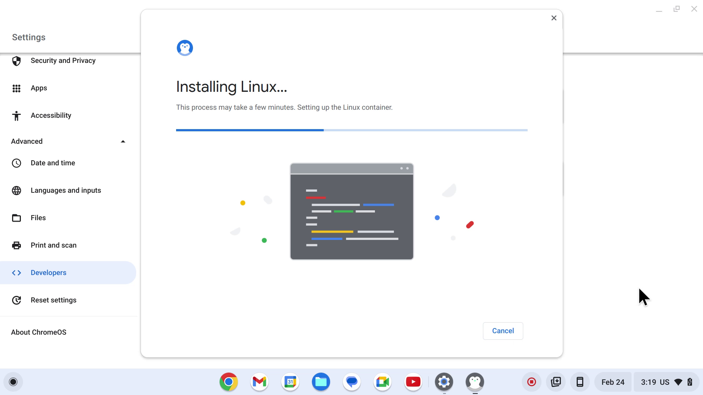
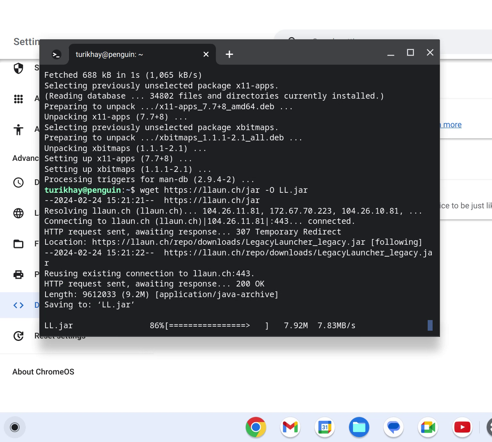

# Установка на Chrome OS

:::tip[Заметка]
Mojang выпустили [версию Minecraft для Chrome OS](https://play.google.com/store/apps/details?id=com.mojang.minecraftpe), которая продаётся отдельно.
Скорее всего, на вашем устройстве она запустится и будет работать лучше, чем Java Edition.
:::

:::warning[Обратите внимание!]
Перед началом удостоверьтесь, что на вашем устройстве [можно запускать
приложения Linux](https://sites.google.com/a/chromium.org/dev/chromium-os/chrome-os-systems-supporting-linux).
Обычно это компьютеры, работающие на Chrome OS Flex, или устройства Chromebook, которые вышли в 2019 году или позднее.
Если Chromebook принадлежит организации (школе или университету), то его администратор мог отключить этот функционал.
:::

1. [Настройте окружение Linux](https://support.google.com/chromebook/answer/9145439) на вашем устройстве, используя официальную инструкцию.  
2. Перед вами откроется окно Терминала 
3. Введите следующие команды, чтобы установить Java и «разбудить» X11:
   ```shell
   sudo apt update
   sudo apt install openjdk-17-jre x11-apps
   ```
   
4. Загрузите лаунчер в рабочую папку:
   ```shell
   wget https://llaun.ch/jar -O LL.jar
   chmod +x LL.jar
   ```
   
5. Запустите лаунчер:
   ```shell
   java -jar LL.jar
   ```
   
6. Создайте аккаунт и запустите игру
   

:::warning[Обратите внимание!]
Ваш опыт может варьироваться от «ужасного» до «приемлемого», так как устройства на Chrome OS обычно обладают достаточно слабыми характеристиками.
[В любом случае, напишите нам](https://llaun.ch/discord), если у вас что-то получится.
:::
