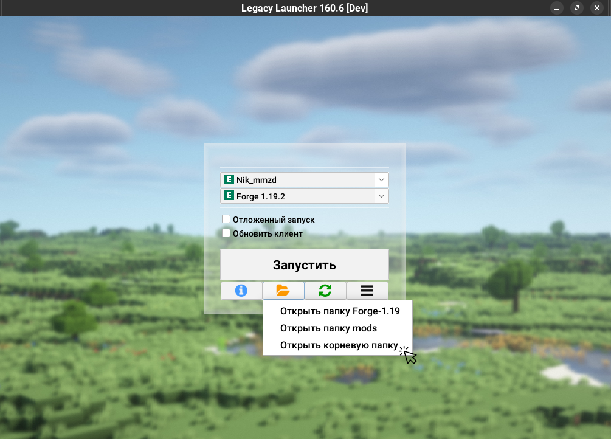
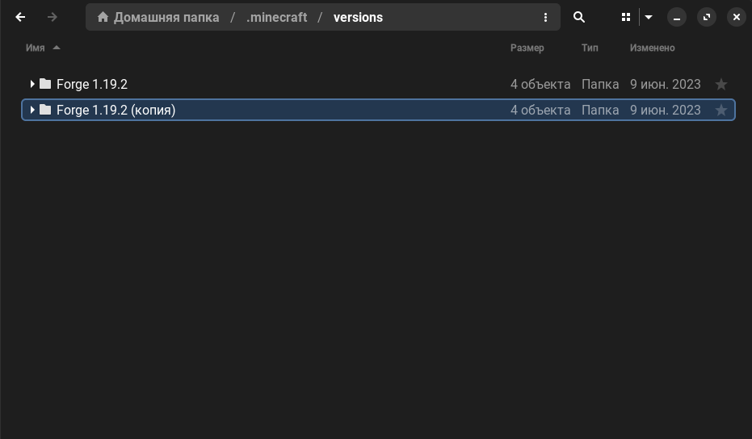
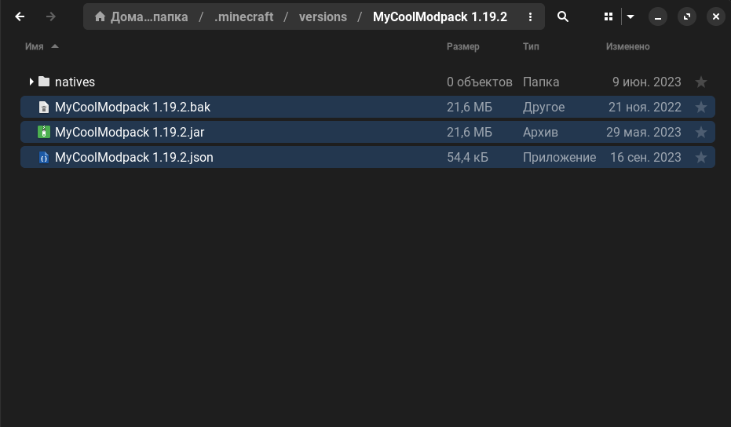

# Клонирование версий
Этот гайд будет полезен для авторов сборок и пользователей, которые хотят держать несколько сборок для одной версии игры с помощью "[подпапок по версиям](../launcher/subfolders)"

## Как скопировать версию?
:::info
Помните, что для полноценной работы с копиями версий вы должны включить "[подпапки по версиям](../launcher/subfolders)"
:::
1. Запустите Legacy Launcher
2. Нажмите на кнопку с иконкой папки, чтобы открыть папку игры
    
    * Лаунчер может предложить выбор папок игры. Выберите "корневую"
        
3. Перейдите в папку `versions`
    
4. Найдите нужную версию и скопируйте её
    
5. Выберите новое имя версии. Для этого гайда мы будем использовать имя `MyCoolModpack 1.19.2`
6. Переименуйте папку в выбранное вами имя
    
7. Откройте папку с копией версии. Переименуйте jar и json файлы внутри в выбранное на шаге 5 имя.
    
    :::warning[Обратите внимание!]
    Имя папки и имена файлов в ней **должны совпадать**, иначе лаунчер **не увидит версию**.  
    Например, для нашего примера папка должна называться `MyCoolModpack 1.19.2`, а файлы в ней - `MyCoolModpack 1.19.2.json` и `MyCoolModpack 1.19.2.jar`
    :::
8. Откройте json-файл любым текстовым редактором (например, [Notepad++](https://notepad-plus-plus.org/downloads/))
9. Найдите поле `id` и смените его содержимое на выбранное вами имя
    ```json
    {
        // highlight-next-line
        "id": "MyCoolModpack 1.19.2",
        "jar": "1.19.2",
        "family": "Forge-1.19",
        "time": "2023-09-16T19:39:53.686Z",
        "releaseTime": "2022-08-05T11:57:05Z",
        "type": "modified",
        "mainClass": "cpw.mods.bootstraplauncher.BootstrapLauncher",
        "minimumLauncherVersion": 21,
        …
    ```
    * Если вы используете "подпапки по версиям" в режиме "Отдельная папка для каждого семейства" - найдите поле `family` и переименуйте его в желаемое название. *Оно не обязано совпадать с выбранным вами именем версии.*
        ```json
        {
            "id": "MyCoolModpack 1.19.2",
            "jar": "1.19.2",
            // highlight-next-line
            "family": "mycoolmodpack",
            "time": "2023-09-16T19:39:53.686Z",
            "releaseTime": "2022-08-05T11:57:05Z",
            "type": "modified",
            "mainClass": "cpw.mods.bootstraplauncher.BootstrapLauncher",
            "minimumLauncherVersion": 21,
            …
        ```
10. Сохраните файл
11. Перезапустите лаунчер. Копия версии появится в лаунчере под выбранным именем.