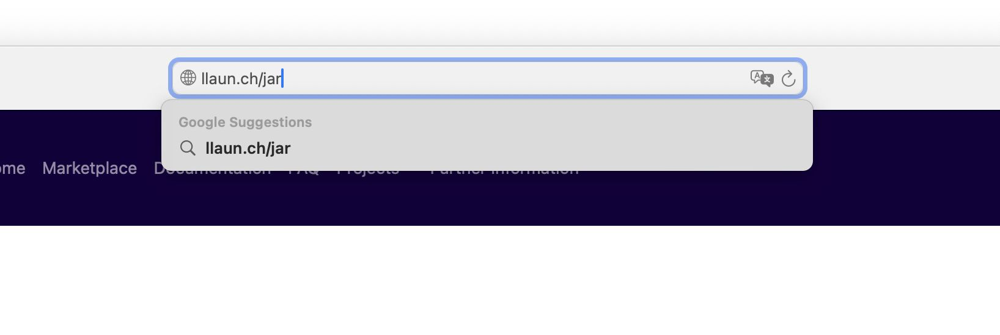
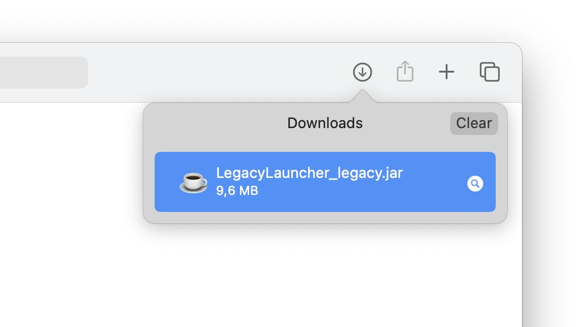
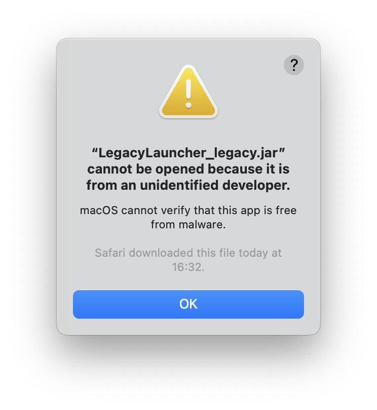
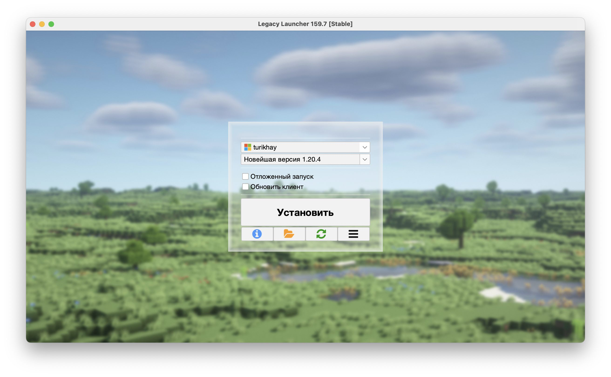

# Ручная установка на macOS

:::warning[Обратите внимание!]
Перед началом на вашем устройстве под управлением macOS должна быть установлена свежая версия Java.
Подробнее об этом [мы писали в соседней статье](./java#macos).
:::

В этой статье мы рассмотрим установку Legacy Launcher вручную на macOS версии 14.3.1. На более старых версиях macOS шаги будут примерно такими же. Этот способ подходит тем, у кого не получилось установить лаунчер, [используя обычный способ установки](https://llaun.ch/macos).

1. Загрузите JAR-файл лаунчера: https://llaun.ch/jar 
2. Попробуйте открыть загруженный файл 
3. Система должна вас предупредить о том, что файл нельзя открыть из-за политики безопасности. Нажмите «ОК» 
4. Откройте «Системные настройки» и найдите «Конфиденциальность и безопасность» в левом боковом меню. Прокрутите основную часть окна вниз и найдите блок «Безопасность». Вы увидите кнопку «Подтвердить вход» под упоминанием лаунчера. Нажмите на эту кнопку, чтобы разблокировать запуск Legacy Launcher.  
5. Если вы всё сделали верно, лаунчер откроется. Готово! 
