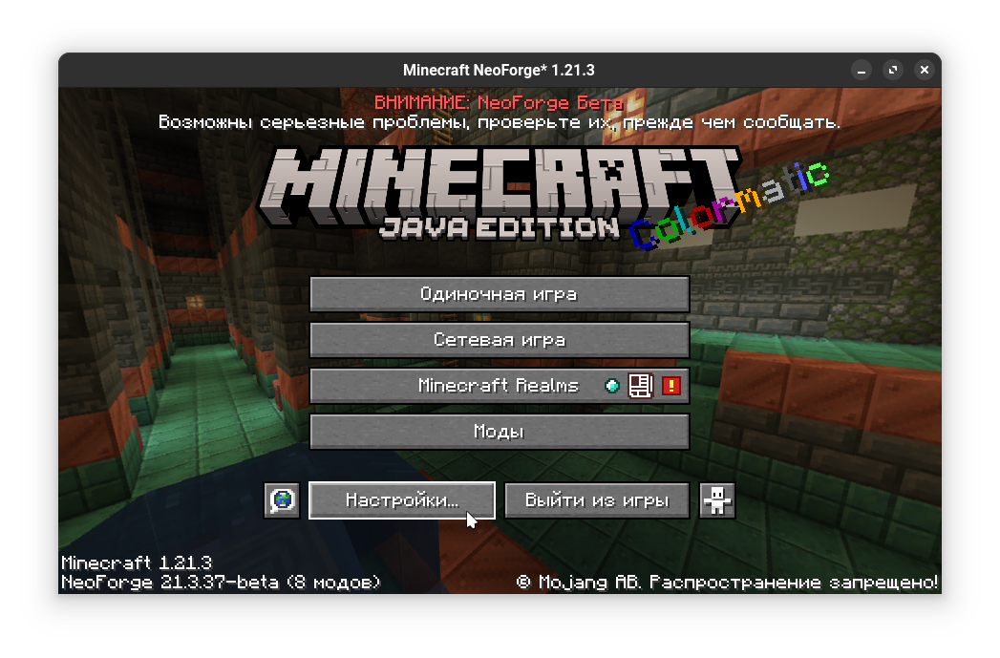
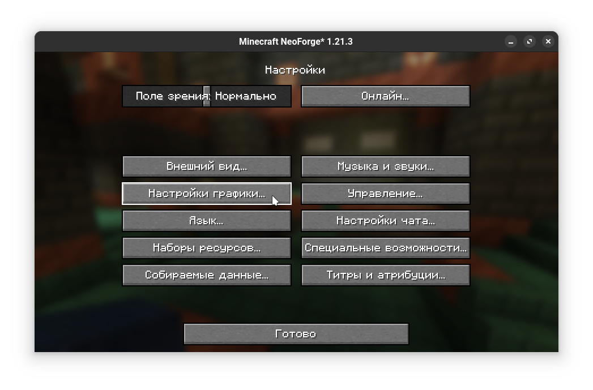
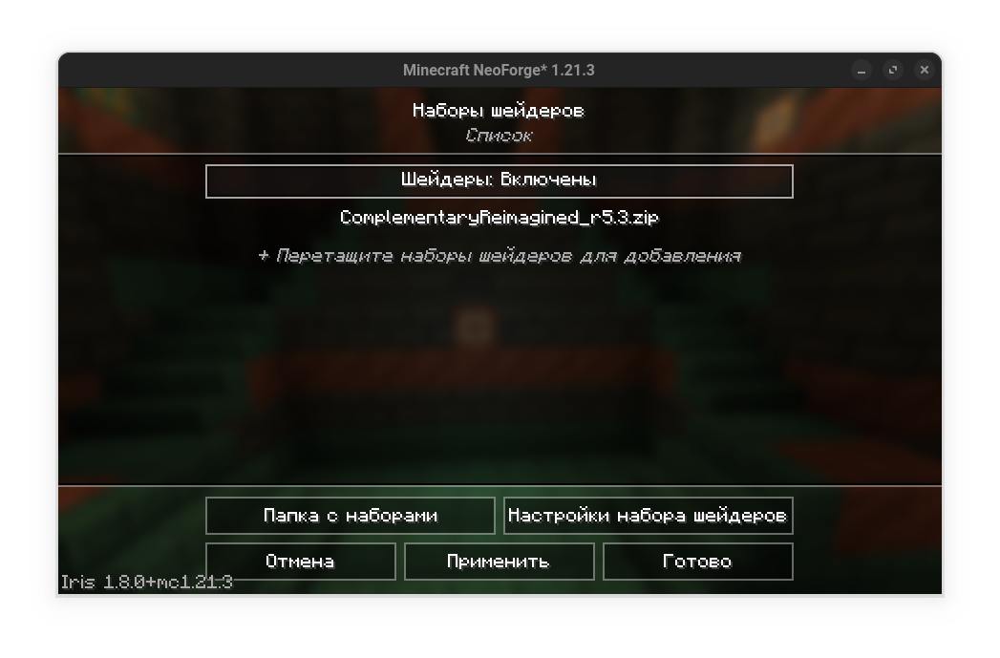
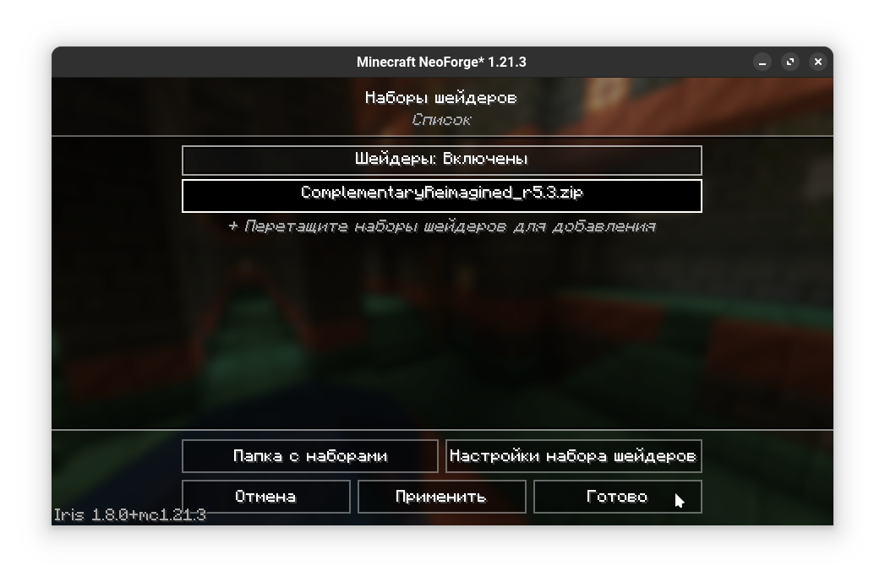

# Установка шейдеров

import Tabs from '@theme/Tabs';
import TabItem from '@theme/TabItem';

1. Установите выбранный [мод на шейдеры](./optifine-alternatives.md#shaders) или [OptiFine](../mods/optifine.md). Вам может потребоваться [загрузчик модов](/tags/modloader)
   :::warning
   OptiFine - крайне нестабильный мод. Мы не рекомендуем использовать его с другими модами. Попробуйте [альтернативы](./optifine-alternatives.md#shaders)
   :::
2. Запустите Minecraft
   :::note
   Это создаст папку `shaderpacks` в папке игры
   :::
3. Скачайте желаемый шейдер с [Modrinth](https://modrinth.com/shaders) или [CurseForge](https://www.curseforge.com/minecraft/search?class=shaders)
4. Поместите скачанные файлы шейдеров в папку `shaderpacks` в папке игры
   :::info[Открытие папки игры]
   1. Кликните иконку папки в лаунчере.
      
   2. Кликните `Открыть папку название-версии`.
      
   :::
   :::tip
   Некоторые моды на шейдеры позволяют вам "перетаскивать" шейдерпаки в меню шейдерпаков в игре вместо открытия папки `shaderpacks` вручную
   :::
5. Запустите Minecraft и перейдите в настройки
   
6. Перейдите в настройки графики
   
   :::note
   Большинство модов-оптимизаторов и модов на шейдеры изменяют структуру "настроек графики". Это может служить дополнительным подтверждением, что мод установлен и работает.
   :::
7. Перейдите в меню "Наборы шейдеров" ("Shader packs")
```mdx-code-block
   <Tabs>
   <TabItem value="Iris/Oculus">
   
   </TabItem>
   <TabItem value="OptiFine">
   
   </TabItem>
   </Tabs>
```
8. Проверьте, что шейдеры включены. Если нет - кликните на "шейдеры: отключены" для их включения. Проигнорируйте этот пункт, если в установленном моде нет этой настройки.
   
9. Вы увидите список установленных в папку `shaderpacks` шейдеров. Выберите желаемый, при необходимости нажмите кнопку "применить" или "готово". В данном примере мы включаем шейдер "Complementary Reimagined"
```mdx-code-block
   <Tabs>
   <TabItem value="Iris/Oculus">
   
   </TabItem>
   <TabItem value="OptiFine">
   
   </TabItem>
   </Tabs>
```
10. Выйдите из меню нажатием кнопки `Готово`
   
