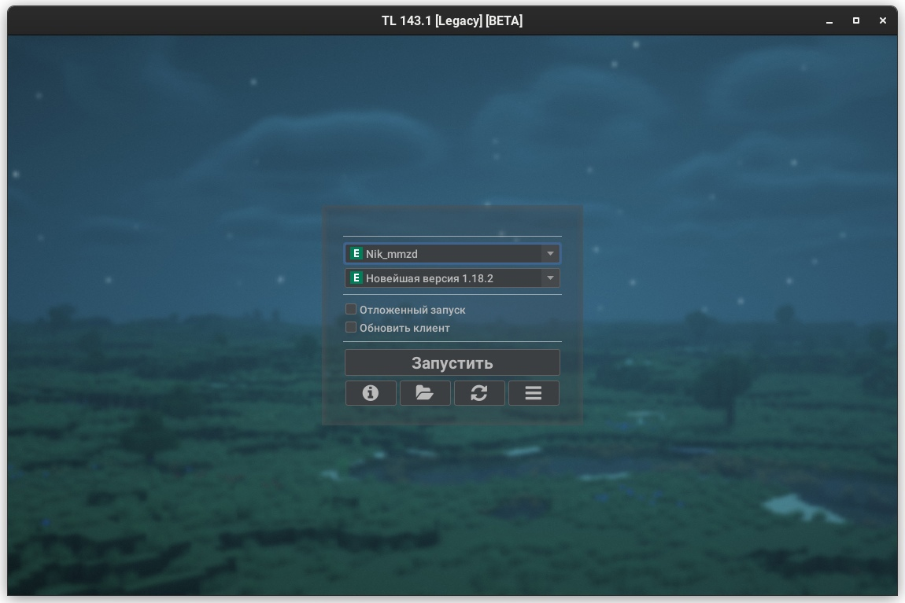
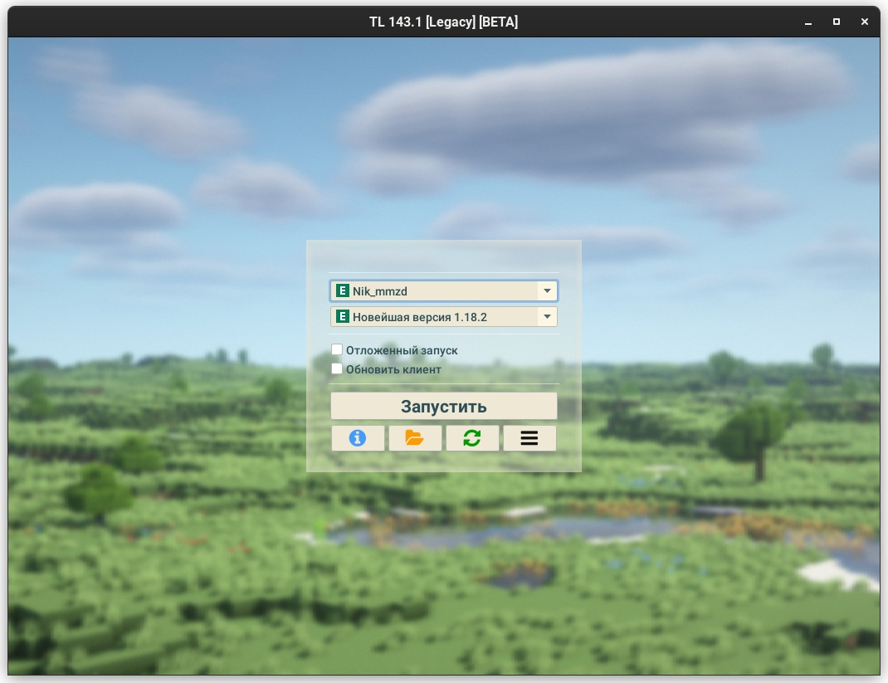
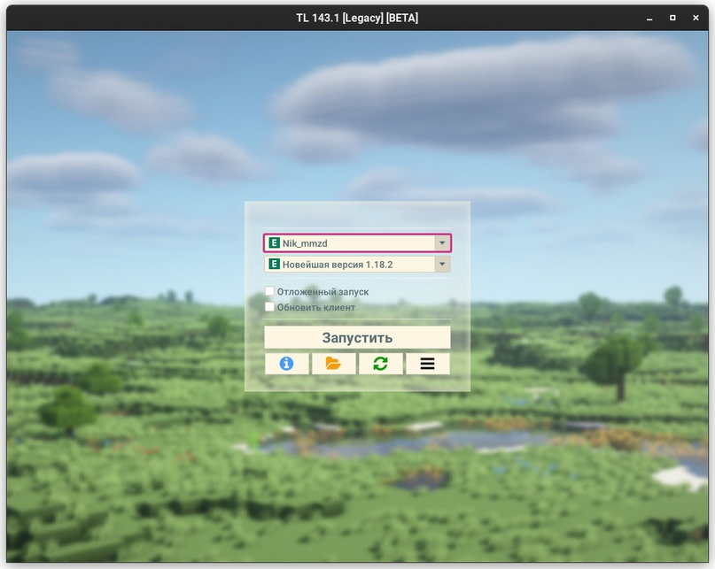

# Кастомизация и темы

import Tabs from '@theme/Tabs';
import TabItem from '@theme/TabItem';

## Настройки лаунчера
В настройках лаунчера ("дополнительно" => "настройки лаунчера и игры" => вкладка "лаунчер") вы можете настроить следующие элементы лаунчера:
* Отображение рекламы (галочка "показывать объявления под формой входа")
* Язык лаунчера
* Тему лаунчера (темная, светлая, автоматическая)
* Расположение формы входа в игру
* Размер шрифта
    :::warning[Изменение данного параметра не рекомендуется!]
    Если шрифт в лаунчере кажется вам слишком мелким, посмотрите в сторону [использования HiDPI](./hidpi)
    :::
* Размер окна лаунчера
* Фон окна лаунчера (поддерживаются форматы `jpg`, `png`, `mp4`)
    :::note[Видеофон]
    Legacy Launcher поддерживает установку видеофона в формате `mp4`. Данный функционал требует использования версии Java с поддержкой JavaFX. Анимированные изображения в форматах `gif` и `animated png` не поддерживаются
    :::

## Темы FlatLaF
:::note[Обратите внимание!]
Темы FlatLaF поддерживаются Legacy Launcher начиная с версии 143.0
:::
### Встроенные темы
Кроме стандартных тем `light` и `dark` доступны темы `intellij` (светлая) и `darcula` (тёмная).  
Также доступно специальное значение `system` для использования системной темы Java.

### Внешние темы
Вы можете создать свою тему в формате FlatLaF или использовать уже существующую!  
Просто скачайте json-файл темы и укажите путь к нему в файле конфигурации лаунчера
:::tip[Где взять темы?]
Посмотреть имеющиеся темы и скачать их json-файл можно в [Demo-приложении FlatLaF](https://www.formdev.com/flatlaf/#demo)
:::
:::info[Хотите создать тему самостоятельно?]
Для вас доступна документация FlatLaF:
    * [Темы](https://www.formdev.com/flatlaf/themes/)
    * [Создание тем](https://www.formdev.com/flatlaf/customizing/)
    * [Настройка тем](https://www.formdev.com/flatlaf/properties-files/)
:::

### Установка темы
1. Закройте Legacy Launcher
2. Откройте файл конфигурации Legacy Launcher любым текстовым редактором (например, [Notepad++](https://notepad-plus-plus.org/downloads/))
    :::tip[Где найти файл конфигурации Legacy Launcher?]
    Чаще всего он будет располагаться либо в папке `.tlauncher/legacy.properties`, либо в файле `tl.properties` по пути установки игры установщиком (`.tlauncher/legacy/Minecraft/tl.properties`)
    :::
3. Найдите (или создайте, при их отсутствии) следующие строки:
    * `gui.laf.v1.flatlaf.light` - для изменения светлой темы
    * `gui.laf.v1.flatlaf.light.ui-properties-file` - для применения `properties`-файла настроек для светлой темы
    * `gui.laf.v1.flatlaf.dark` - для изменения тёмной темы
    * `gui.laf.v1.flatlaf.dark.ui-properties-file` - для применения `properties`-файла настроек для тёмной темы
4. Укажите путь к нужному файлу темы или файлу настроек. Вы можете указать название *встроенной* темы через символ `:`, например, `gui.laf.v1.flatlaf.light=:system`
5. Сохраните файл и перезапустите лаунчер

### Примеры тем
```mdx-code-block
<Tabs>
<TabItem value="Darcula">
```


```mdx-code-block
</TabItem>
<TabItem value="IntelliJ">
```

```mdx-code-block
</TabItem>
<TabItem value="Solarized Light">
```

```mdx-code-block
</TabItem>
<TabItem value="Solarized Light High-Contrast">
```

```mdx-code-block
</TabItem>
<TabItem value="Solarized Dark">
```

```mdx-code-block
</TabItem>
<TabItem value="Material Deep Ocean">
```

```mdx-code-block
</TabItem>
</Tabs>
```

## Темы лаунчера
:::warning[Обратите внимание!]
Этот формат тем создан специально для Legacy Launcher, но позволяет лишь частичную модификацию внешнего вида интерфейса. Мы рекомендуем использовать **темы FlatLaF**
:::
Цветовая схема хранится в файле с разрешением `.properties` с кодировкой UTF-8.

Передать местонахождение файла можно либо указав его путь в файле настроек в поле `gui.theme`, либо передав аргументом `--theme путь`

### Типы значений
* `color` - задает цвет в формате `Red.Green.Blue[.Alpha]` (например, `255.255.255.128` задает полупрозрачный белый цвет, а `0.0.0.0` - непрозрачный черный)
* `int` - задает размер в формате положительного целого числа (т.е. больше или равно 0)
* `enum` - указывает, что поле может принимать только указанные значения (либо никакое)
* `mixed` - поле может принимать несколько типов значений из описанных выше

### Синтаксис файла
| Ключ                  | Тип                                  | Описание                                                                                                                  |
|-----------------------|--------------------------------------|---------------------------------------------------------------------------------------------------------------------------|
| `foreground`          | `color`                              | Цвет переднего плана (текста)                                                                                             |
| `background`          | `color`                              | Цвет заднего плана (подложка в текстовых полях)                                                                           |
| `semiforeground`      | `color`                              | Цвет замещающего текста (подсказок в текстовых полях)                                                                     |
| `panelbackground`     | `color`                              | Цвет панелей (форма входа, настройки и т.д.)                                                                              |
| `success`             | `color`                              | Разрешающий цвет (по умолчанию темно-зеленый)                                                                             |
| `failure`             | `color`                              | Запрещающий цвет (по умолчанию темно-красный)                                                                             |
| `border`              | `color`                              | Цвет границ панелей по умолчанию                                                                                          |
| `border.size`         | `int`                                | Размер внешних границ панелей                                                                                             |
| `shadow`              | `mixed`: (`color`, `enum`: `border`) | Задаёт цвет внутренней тени. При значении `border` начальный цвет внутренней тени по умолчанию равен цвету границы панели |
| `icon.defaultColor`   | `color`                              | Цвет иконок по умолчанию                                                                                                  |
| `icon.color.<иконка>` | `color`                              | Цвет иконки `иконка` (напр. `icon.color.refresh`)                                                                         |
| `border.<панель>`     | `color`                              | Цвет границы указанного типа панелей                                                                                      |
| `shadow.<панель>`     | `color`                              | Начальный цвет тени указанного типа панелей                                                                               |
| `arc.<панель>`        | `int`                                | Радиус закругления границ указанного типа панелей                                   

Доступные типы панелей:
* `main_panel` - представляет главные панели (форма входа, формы авторизации)
* `additional_panel` - представляет дополнительные панели («Дополнительно», подсказки в форме входа)
* `settings_panel` - представляет внутреннюю панель в панели настроек

### Примеры
```properties title="Базовый пример файла theme.properties"
foreground=0.0.0
background=255.255.255
panelbackground=255.255.255.64
shadow=0.0.0.0
arc=16
```
```properties title="nostalgic.properties"
# Эта тема повторяет старое оформление панелей в Legacy Launcher
border=28.128.28.255
border.size=2
arc=32
shadow=0.0.0.0
panelbackground=255.255.255.168
border.main_panel=28.128.28.255
border.additional_panel=28.128.28.255
border.settings_panel=28.128.28.255
```