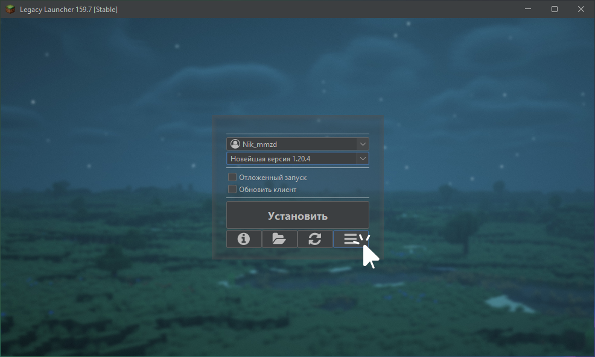
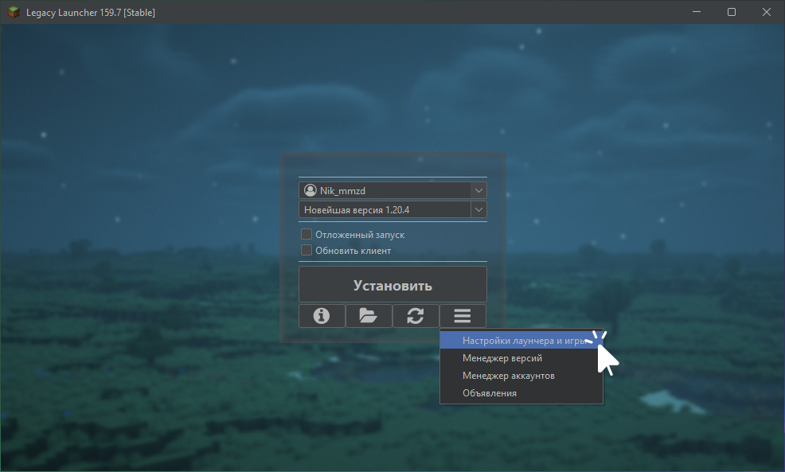
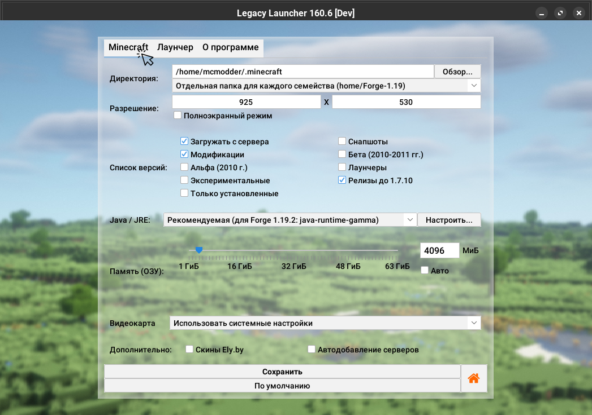

# Подпапки по версиям
Поскольку моды для различных версий игры и загрузчиков модов друг с другом не совместимы, мы добавили в Legacy Launcher режим "подпапок по версиям"
:::tip
Вы можете использовать эту функцию как замену профилям, чтобы держать несколько разных сборок на одной версии игры одновременно. Подробнее - в соответствующей [инструкции](../faq/custom-versions)
:::

## Как включить? {#enable}
1. Запустите Legacy Launcher
2. Нажмите кнопку "Дополнительно"
    
3. Выберите пункт "Настройки лаунчера и игры"
    
4. Перейдите на вкладку "Minecraft"
    
5. В пункте "директория" выберите нужный режим
    

## Варианты "подпапок по версиям" {#modes}
Legacy Launcher поддерживает три режима работы этой опции
:::info[Как найти папку игры?]
Независимо от настроек вы всегда можете открыть папку игры или модов текущей версии кликом по иконке папки в главном меню лаунчера
:::
:::warning
Вы должны указывать в установщиках модов и версий (например, в установщиках Fabric и Forge) ту же папку, что и в пункте "Директория" **независимо от выбранного режима "подпапок по версиям"**, т.к. именно в этой папке хранятся файлы игры
:::

### Не использовать отдельные папки {#mode-none}
Игра будет запущена в папке игры. Никакого разделения по подпапкам произведено не будет.

### Отдельная папка для каждого семейства {#mode-families}
Для каждой версии игры будет создана папка её "семейства" в папке `home` в папке игры. В этой папке будут храниться все настройки, миры, моды, ресурспаки, шейдерпаки версии.  
**Семейства** - это набор версий с похожим загрузчиком модов и схожими версиями. Например, `1.8.9` и `1.8.8` будут принадлежать к семейству `1.8`, а `Fabric 1.19.2` и `Quilt 1.19.2` - к `Fabric-1.19`. Для снапшотов есть отдельное семейство - `snapshots`.  
Например, версия `1.8.9` будет запущена в `папка-игры/home/1.8`, а `Forge 1.12.2` - в `папка-игры/home/Forge-1.12`

### Отдельная папка для каждой версии {#mode-versions}
Для каждой версии игры в папке `home` в папке игры будет создана папка с **именем версии**. В этой папке будут храниться все настройки, миры, моды, ресурспаки, шейдерпаки версии. Семейства в этом режиме не учитываются.  
Например, версия `1.8.9` будет запущена в `папка-игры/home/1.8.9`, а `Forge 1.12.2` - в `папка-игры/home/Forge 1.12.2`