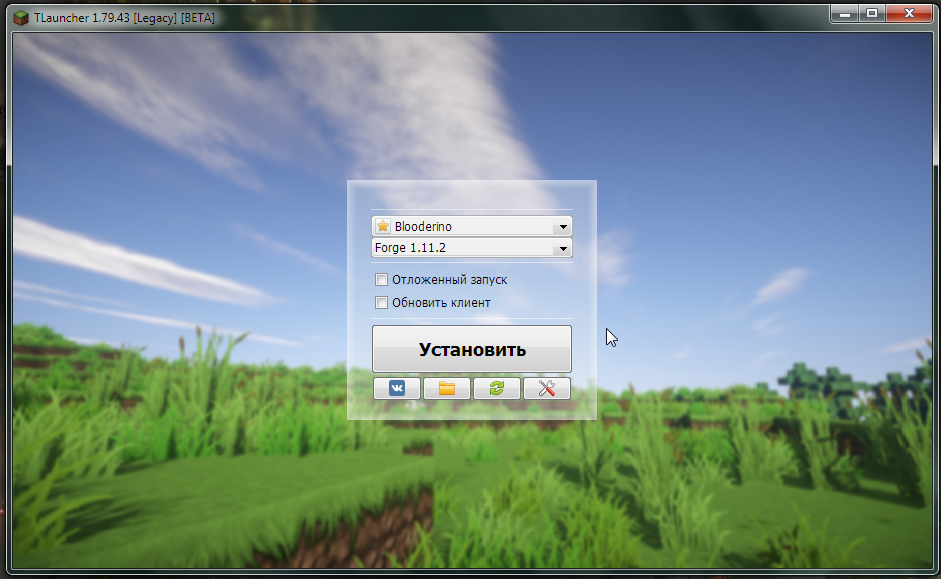

# Установка модов
Моды (они же модификации) являются пользовательскими дополнениями, которые расширяют базовые возможности игры, добавляя для этого новые блоки, инструменты, оружие, мобов, измерения и многое другое.  
Данное руководство описывает, каким образом можно устанавливать моды.
:::warning
Скриншоты в данном руководстве слегка устарели.  
Если у вас есть возможность, помогите нам [обновить](https://github.com/LegacyLauncher/docs/pulls) данный гайд!
:::
:::tip[Установка сборок]
Ищете инструкцию по установке сборок/модпаков? Посмотрите [эту инструкцию](./modpacks)
:::
:::tip[Установка OptiFine]
Ищете инструкцию по установке OptiFine? Посмотрите [эту инструкцию](./optifine)
:::

## Подготовка к установке
:::tip[Портативный клиент]
Если вы планируете распространять сборку среди других людей - возможно, стоит посмотреть в сторону создания [портативного клиента](../launcher/portable)
:::
:::info[Подпапки по версиям]
Чтобы моды, миры и настройки для разных версий игры и загрузчиков модов не смешивались между собой и не вызывали проблем, мы рекомендуем использовать [подпапки по версиям](../launcher/subfolders)
:::
1. Запустите Legacy Launcher
2. Установите требуемую версию загрузчика модов. Разные моды могут требовать разные загрузчики модов. На момент написания статьи Legacy Launcher предоставляет выбор из трех загрузчиков модов: Forge, Fabric и Quilt.
    :::tip[Нет нужной версии загрузчика мода?]
    Вы можете установить любую версию [Forge](./forge), [NeoForge](./neoforge), [Fabric](./fabric) и [Quilt](./quilt) самостоятельно.
    :::
    :::warning[Будьте внимательны!]
    Моды для NeoForge могут быть несовместимы с Forge.  
    Моды для Quilt могут быть несовместимы с Fabric.  
    Моды для Fabric/Quilt и Forge/NeoForge не совместимы друг с другом.
    :::
    
3. Убедитесь, что версия запускается.
    
    :::warning[Не запускается версия?]
    Убедитесь, что у вас не установлено модов для других версий игры и загрузчиков модов.  
    Всё ещё не запускается? Вы можете попробовать наш гайд по [самостоятельному решению проблем](../troubleshooting/self-repair) или [обратиться в техническую поддержку](../support/game)
    :::

## Установка модов
1. Найдите и скачайте понравившийся мод под нужную версию игры
    :::tip[Официальные источники модов]
    Мы рекомендуем скачивать моды с официальных источников - [Modrinth](https://modrinth.com/mods) и [CurseForge](https://www.curseforge.com/minecraft/search?class=mc-mods)
    :::
2. Запустите Legacy Launcher и с его помощью откройте папку игры
    
3. В открывшемся окне перейдите в папку mods
    
4. Поместите скачанный файл мода в данную папку
    
5. Запустите игру, чтобы проверить работоспособность клиента после установленных модификаций
    
    :::note
    Видно, что количество модов, которые подгрузил Forge ModLoader, увеличилось (было 4 мода, стало 5). Также можно увидеть модификацию в списке, в который можно попасть, нажав на кнопку Mods в главном меню игры.
    
    :::
6. Готово! Теперь контент из мода можно найти в игре.

## Распространенные ошибки
Несмотря на всю относительную простоту установки модов, пользователи иногда совершают ошибки, которые приводят к поломке клиента игры.

### Архив в архиве
На многих неофициальных ресурсах с тематикой Minecraft для экономии места на сервере моды добавляются в дополнительный архив, который уменьшает размер мода. Но такой мод перестает читаться игрой. Исправить это очень просто: нужно распаковать данный архив в по соответствующему пути.

### Распакованный мод
Данная ошибка вытекает из предыдущей: пользователь распаковал мод *.jar, хотя этого не требовалось. Исправить это также очень просто: нужно запаковать весь распакованный мод в *.zip-архив, а потом полученный архив переименовать в *.jar… Или просто скачать мод заново.

### Нет необходимых зависимостей модов
С давних пор разработчики модов используют одни моды для создания других. Это приводит к тому, что созданный мод не работает без мода, с помощью которого он был создан (т.е. без *зависимостей*).  
Пользователь, не знающий этих тонкостей, может просто не установить необходимые для работы мода зависимости. Результатом такой оплошности может быть поломка клиента игры или предупредительная надпись в игре после загрузки.

Решить эту проблему достаточно легко: нужно просто скачать недостающий мод заявленной в сообщении версии (в примере это `CodeChickenLib 2.6.0`).

### Мод для другой версии игры
Данная ошибка вызвана тем, что пользователь скачал мод не для своей версии игры. Например, ему нужен был мод для Minecraft 1.8, а он скачал мод для Minecraft 1.6.4. Решить эту проблему достаточно просто: нужно найти этот же мод, но только под свою версию игры.
:::note
Иногда авторы модов заканчивают поддержку модов или не выпускают свой мод для более старых версий игры. Из-за этого, например, мод, который стоял на Minecraft 1.7.10, никогда не появится для Minecraft 1.12.2. В данном случае остается только искать альтернативу или учиться самостоятельно разрабатывать моды.
:::

### Неподходящая версия загрузчика модов
Legacy Launcher поставляет только **стабильные** (stable, release, recommended) версии загрузчиков модов. Если моду требуется другая версия загрузчика - вы должны установить требуемую версию [Forge](./forge), [NeoForge](./neoforge), [Fabric](./fabric) или [Quilt](./quilt) самостоятельно.

### Специфичные для модов проблемы
Некоторые моды требуют особой настройки клиента. Для самых популярных случаев мы создали [отдельный набор инструкций](/category/%D1%81%D0%BF%D0%B5%D1%86%D0%B8%D1%84%D0%B8%D1%87%D0%BD%D1%8B%D0%B5-%D0%B4%D0%BB%D1%8F-%D0%BC%D0%BE%D0%B4%D0%BE%D0%B2-%D0%BF%D1%80%D0%BE%D0%B1%D0%BB%D0%B5%D0%BC%D1%8B)

### Ничего не работает!
Вы можете попробовать наш гайд по [самостоятельному решению проблем](../troubleshooting/self-repair) или [обратиться в техническую поддержку](../support/game)