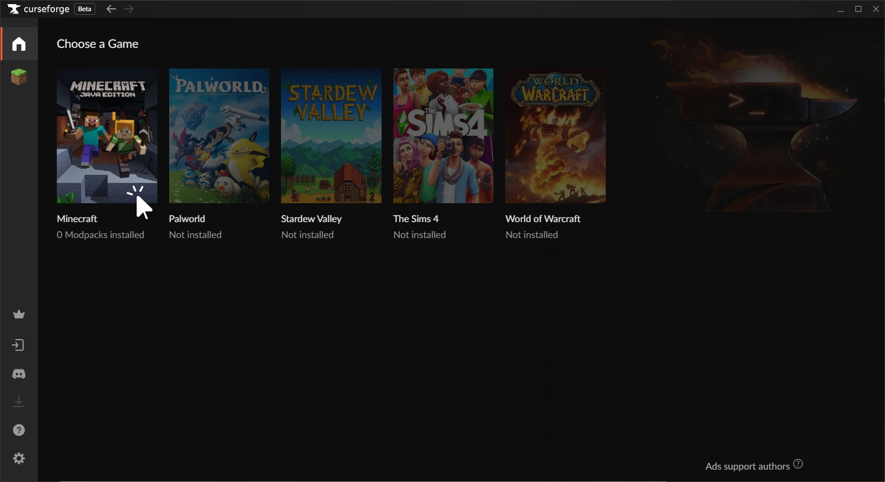
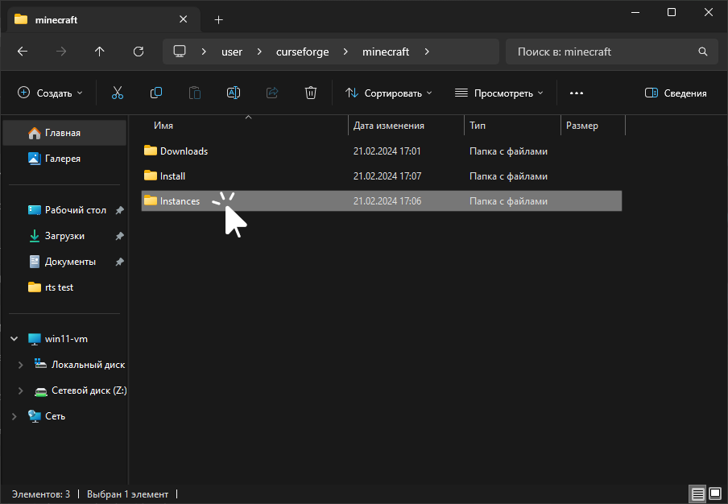
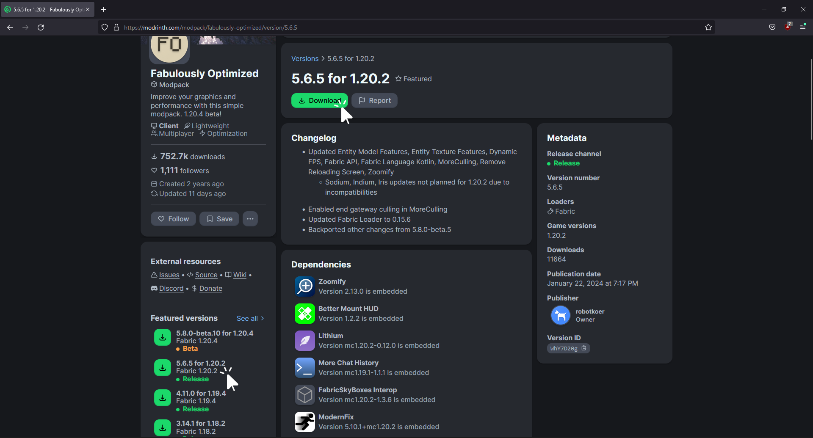
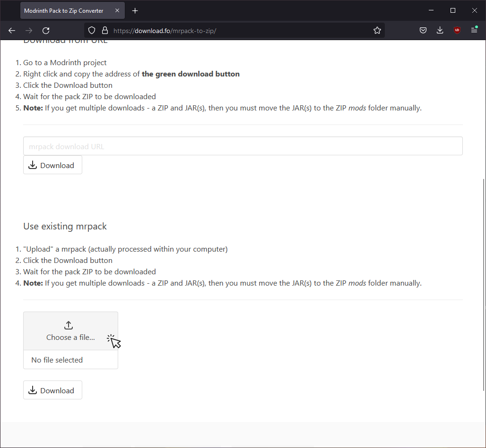
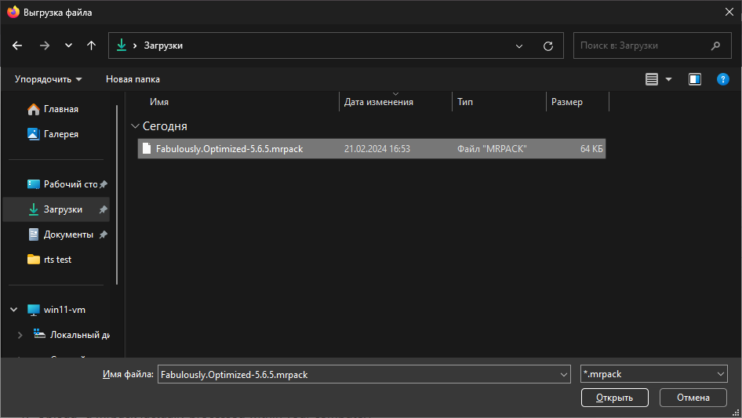
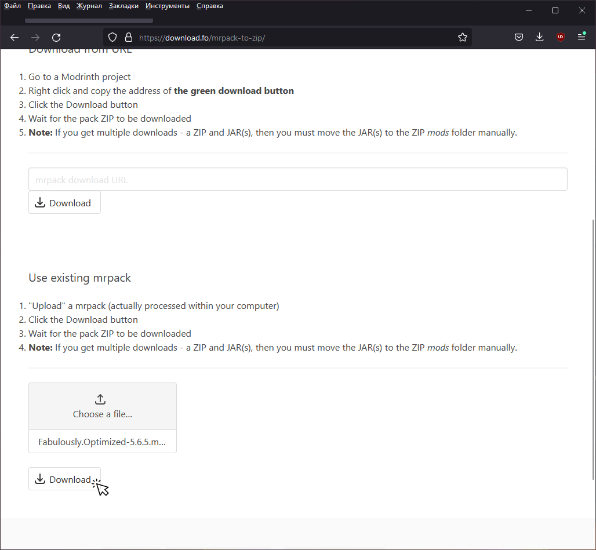

# Установка сборок
Установка сборки по своей сути не отличается от [установки модов](./installation). Всё зависит от источника сборки.

## Curseforge
1. Скачайте и установите [приложение CurseForge](https://www.curseforge.com/download/app)
    :::tip
    Рекомендуем выбирать "Standalone"-загрузку, а не "Overwolf"
    :::
2. Выберите игру "Minecraft"
    
3. Перейдите на вкладку "Browse"
    
    :::tip
    Приложение CurseForge позволяет не только скачивать свои сборки, но и создавать свои с помощью кнопки "Create Custom Profile". Эта инструкция не покрывает данную возможность. Вы можете попытаться разобраться в создании сборок самостоятельно.
    :::
4. Выберите нужный модпак и нажмите кнопку "Install"
    
5. Дождитесь скачивания всех файлов игры
6. Откройте папку с файлами сборок
    
7. Перейдите в папку `Instances`
    
8. Найдите папку установленной сборки и перейдите в неё
    
9. Установите требуемый сборкой [загрузчик модов](/tags/modloader)
10. Запустите Legacy Launcher и с его помощью откройте папку игры
    
11. Переместите файлы сборки в папку игры
    
12. Готово! Можно запускать игру

## Modrinth
1. Выберите нужный модпак на [Modrinth](https://modrinth.com/modpacks)
2. Скачайте `.mrpack`-файл нужной версии сборки
    
3. Перейдите на сайт [Modrinth Pack to Zip](https://download.fo/mrpack-to-zip/)
4. Найдите пункт "Use existing mrpack" и нажмите "Choose a file..."
    
5. В открывшемся окне выберите скачанный `.mrpack`-файл
    
6. Нажмите кнопку "Download" и дождитесь окончания загрузки всех файлов
    
7. Сохраните полученный zip-архив со сборкой
8. Установите требуемый сборкой [загрузчик модов](/tags/modloader)
9. Запустите Legacy Launcher и с его помощью откройте папку игры
    
10. Откройте архив сборки
11. Переместите файлы сборки в папку игры
    
12. Готово! Можно запускать игру

## Другие сайты
Другие сайты и пользователи, скорее всего, передадут вам сборку в формате zip-архива.
1. Установите требуемый сборкой [загрузчик модов](/tags/modloader)
2. Запустите Legacy Launcher и с его помощью откройте папку игры
    
3. Откройте архив сборки
4. Переместите файлы сборки в папку игры
    
5. Готово! Можно запускать игру