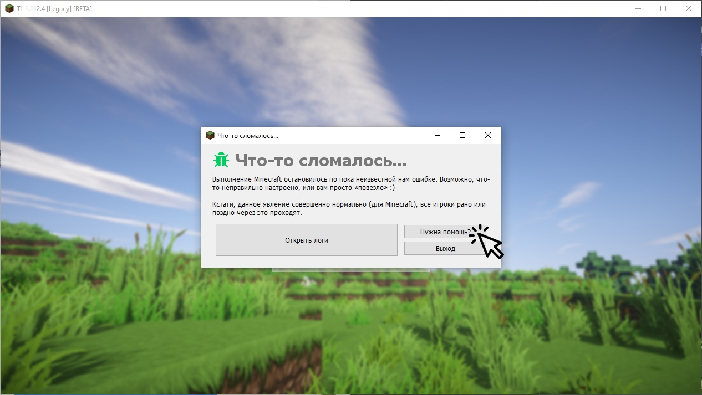
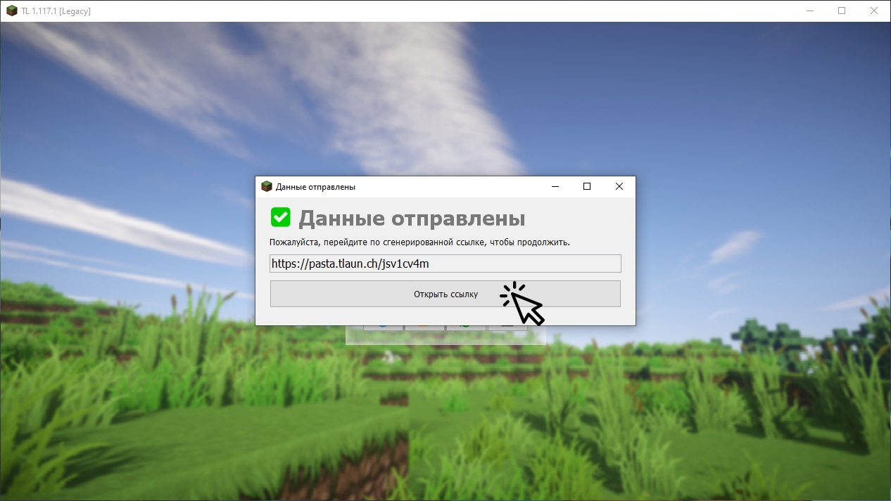
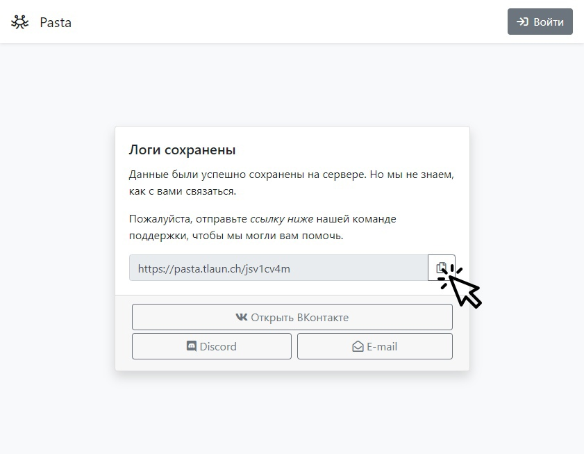
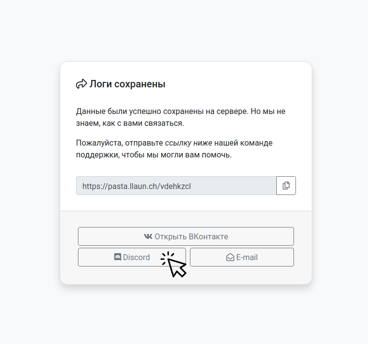
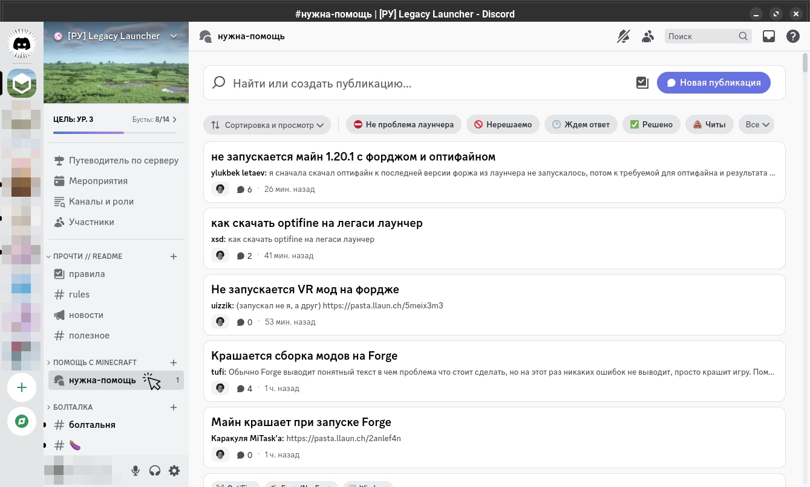

# Нужна помощь?
На этой странице находится инструкция по описанию проблем с Legacy Launcher.
:::tip
Не хочешь ждать? Попробуй нашу инструкцию по [самостоятельному решению проблем](../troubleshooting/self-repair)
:::

## Собери диагностическую информацию о проблеме
1. Убедись, что ты используешь последнюю версию лаунчера. Попробуй включить бета-версию лаунчера в настройках - возможно, это поможет
2. Проверь, что твой компьютер/ноутбук [подходит для запуска этой игры](../system-requirements)
3. Попытайся запустить игру ещё раз. Сделай так, чтобы ошибка возникла повторно.
4. В появившемся окне ошибки кликни "Нужна помощь?"
    
    :::tip[Нет окна ошибки? Нет кнопки "нужна помощь?"]
    1. В главном меню кликни по кнопке информации
        
    2. Выбери пункт "нужна помощь?"
        
    :::
5. Отправь диагностические данные
    :::warning[Обратите внимание!]
    Не забудь отметить галочку "отправить диагностические данные"!
    :::
    
    :::note
    Если не получится отправить диагностические данные, то лаунчер предложит сохранить их в виде файла. Сохрани их в удобное время и загрузи их к нам [вручную](https://pasta.llaun.ch)
    :::
6. Открой полученную ссылку
    
7. В браузере **не забудь скопировать предоставленную ссылку** - она потребуется нам для решения проблемы
    

## Обратись в нашу техническую поддержку
Выбери на странице удобный способ связи - [ВКонтакте](#вконтакте), [Discord](#discord) или [электронную почту](#электронная-почта)
### ВКонтакте
1. Открой чат с нашей [группой ВКонтакте](https://llaun.ch/vk)
    
2. Опиши проблему, скопируй в чат скопированную ранее ссылку и/или полученный ранее файл
    
3. Отправь сообщение и жди ответа. Мы ответим при первой возможности.
### Discord
1. Перейди на наш сервер Discord
    
2. Открой канал "нужна-помощь"
    
3. Нажми кнопку "Новая публикация"
    
4. Введи краткий заголовок и опиши проблему. Выбери подходящие теги. Не забудь вставить скопированную ранее ссылку или полученный ранее файл.
5. Опубликуй сообщение и жди ответа.
    
### Электронная почта
:::warning[Высокие сроки ожидания!]
Мы не имеем возможности часто проверять электронную почту и можем долго отвечать на обращения.  
Мы рекомендуем обращаться в нашу [группу ВК](#вконтакте) или в [Discord](#discord)
:::
1. Нажми на кнопку "E-mail". Откроется E-mail клиент с шаблоном письма.
2. Опиши проблему, приложи полученные ранее ссылку и/или файл
    :::warning
    Пожалуйста, не убирай код ошибки (в квадратных скобках) из темы письма!
    :::
3. Отправь письмо и ждите ответа.