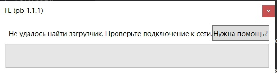
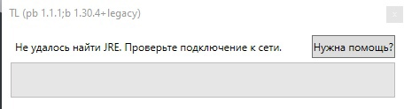

# Проблемы старой exe-версии
```mdx-code-block
<div style={{textAlign: 'center'}}>
```
  
```mdx-code-block
</div>
```
"Не удалось найти загрузчик"? "Не удалось найти JRE"? "Проверьте подключение к сети"? Не закрывается окно с бегущей полосой и надписью "запуск"?  
Это значит, что вы используете **устаревшую exe-версию**.

## Как решить?
Скачайте и установите актуальную версию лаунчера с [нашего сайта](https://llaun.ch) или [его зеркала](https://lln4.ru)

## Я не потеряю миры, моды, ресурспаки, аккаунты?
Если вы боитесь потери данных - можете на всякий случай скопировать их в другое место.  

## После установки лаунчера пропали все файлы игры - миры, моды, аккаунты!
Они не пропали. Скорее всего, вы установили лаунчер в другую папку.  
Зайдите в настройки лаунчера ("Дополнительно" - "Настройки лаунчера и игры" - "Minecraft") и в пункте "Директория" выберите старую папку игры, либо скопируйте файлы игры в новую папку

## У меня портативная сборка, что делать?
Скачайте и установите актуальную версию портативной сборки лаунчера с [нашего сайта](https://llaun.ch/portable) или [его зеркала](https://lln4.ru/portable) и переместите файлы и настройки в неё.
:::tip
Возможно, вам пригодится наша [инструкция по созданию портативного клиента игры](../launcher/portable)
:::

## У меня сборка с MineModPacks, что делать?
1. Удалите из папки сборки exe-файл лаунчера (скорее всего, будет называться "запустить сборку") и файл `.pbargs`, чтобы избежать путаницы.
2. Скачайте актуальную версию портативной сборки лаунчера с [нашего сайта](https://llaun.ch/portable) или [его зеркала](https://lln4.ru/portable)
3. Скопируйте файлы нового портативного клиента в папку сборки с MineModPacks. Подтвердите замену файлов при необходимости.
4. Откройте файл `tl.args` любым текстовым редактором (например, [Notepad++](https://notepad-plus-plus.org/downloads/)) и замените его содержимое на следующее:
    ```bash title="tl.args"
    --packageMode
    portable
    --targetJar
    launcher/launcher.jar
    --targetLibFolder
    launcher/libraries
    --
    --settings
    Launcher/Launcher.properties
    --background
    Launcher/Background.png
    --directory
    ./Minecraft
    --version
    MineModPacks
    ```
5. Готово! Теперь сборка должна начать запускаться.
    :::warning
    Если сборка всё ещё не работает - попробуйте перенести файлы сборки на обычную версию лаунчера или обратитесь к [администрации MineModPacks](https://minemodpacks.ru/%D0%B8%D0%BD%D1%84%D0%BE%D1%80%D0%BC%D0%B0%D1%86%D0%B8%D1%8F#%D0%9A%D0%BE%D0%BD%D1%82%D0%B0%D0%BA%D1%82%D1%8B)
    :::