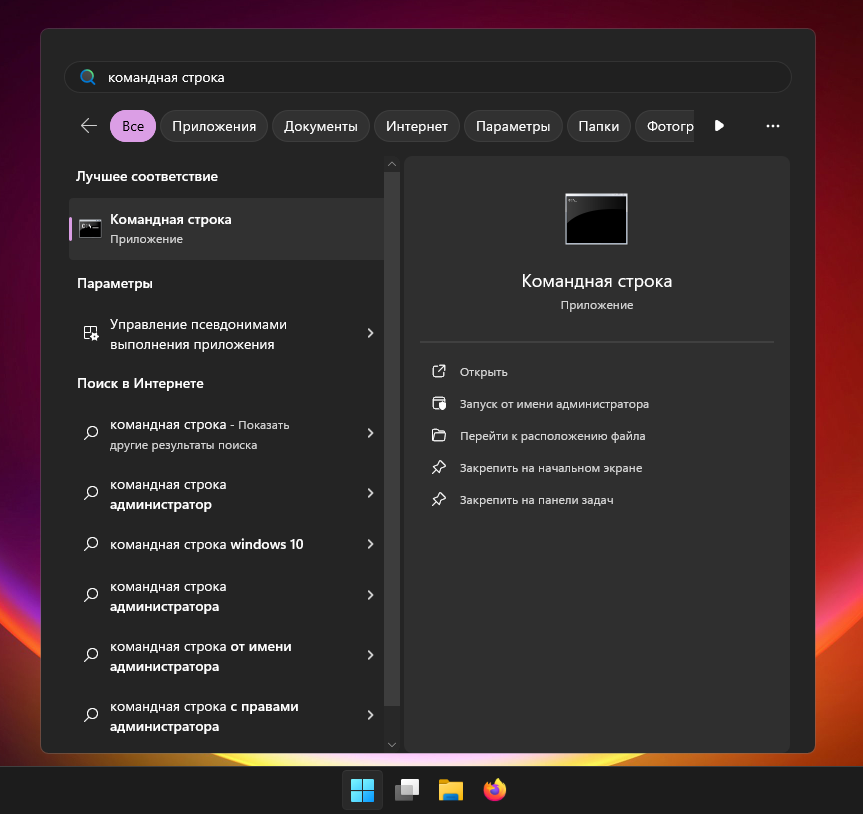
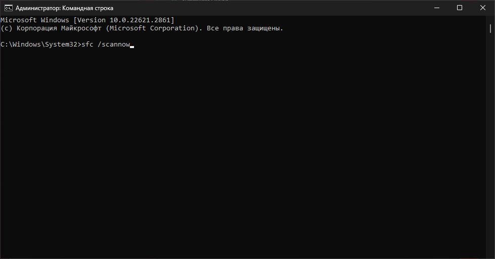

# Краши Java (Windows)
:::note
Эта инструкция - только для непонятных крашей со стороны Java, специфичных для Windows. Мы рекомендуем сначала проверить наличие [самых распространенных проблем](./common)
:::
В логах часто мелькают ошибки `EXCEPTION_ACCESS_VIOLATION` или Minecraft крашится с `exit code` из кучи цифр? Попробуйте эту инструкцию!
:::warning
Если вас сюда направили - это значит, что причина ошибки **нам точно не известна**, и при этом ошибка произошла **на стороне Java или какой-то системной библиотеки**.  
Эта инструкция содержит множество _потенциальных_ решений на основе сообщений от пользователей.  
Если вы столкнулись с проблемой, и смогли решить её с помощью этой инструкции - пожалуйста, сообщите нам, какой именно пункт вам помог.  
Если вы нашли своё собственное решение проблемы после того, как вас послали на эту страницу - также просим сообщить нам. Возможно, вы сможете помочь и другим игрокам!
:::

## Проверьте загруженность ПК {#check-load}
Откройте "диспетчер задач". Убедитесь, что у вас есть свободная оперативная память. Проверьте, что файл подкачки не отключен и не зафиксирован на конкретном значении.
:::tip[Не знаете, как настроить файл подкачки?]
Вот [инструкция для Windows](https://remontka.pro/fail-podkachki-windows/). Убедитесь, что у вас отмечена галочка "автоматически выбирать объем файла подкачки"
:::

## Установите другую версию Java {#replace-java}
Мы подготовили для вас уже готовый пакет для замены Java. Воспользуйтесь [этой инструкцией](../faq/custom-java#how-to-simplified).

## Отключите "Оптимизированные аргументы" {#disable-arguments}
Лаунчер добавляет набор настроек Java, ориентированных на более плавную и стабильную работу игры, но в некоторых случаях эффект может быть противоположным.
1. Откройте настройки лаунчера, на вкладке "Minecraft" перейдите в настройки Java
    
2. В открывшемся окне снимите галочку "Добавлять оптимизированные аргументы"
    :::note
    На новых версиях лаунчера вы можете попробовать другой набор оптимизированных аргументов вместо их полного отключения
    :::

## Удалите нестабильные моды {#remove-bad-mods}
Следующие модули замечены в регулярной поломке Java. Их удаление обычно решает проблему:
* Моды от topka
* Моды от sacura
* Моды от darkness
* Моды от xorek
* Моды от pulse
* Моды от fever

## Удалите графические моды {#remove-graphics-mods}
Было замечено, что некоторые драйвера видеокарт плохо работают с модами-оптимизаторами. Альтернативой может быть [откат драйвера](#gpu-driver). Следующие моды могут вызывать краш из-за багов видеодрайвера:
* OptiFine
* Sodium и его порты (Magnesium, Rubidium, Embeddium...)
* Iris и его порты (Oculus)

## Проблемы с драйвером видеокарты {#gpu-driver}
Зачастую, проблемы с игрой начинаются из-за обновления или повреждения драйвера видеокарты. Если это не помогает - попробуйте [удалить графические моды](#remove-graphics-mods)
* Попробуйте обновить драйвер видеокарты
* Если проблема началась после обновления драйвера, или проблема не уходит - попробуйте откатить драйвер видеокарты
    * Для этого вам нужно скачать и установить более старую версию драйвера
        * NVIDIA: [Архив версий драйверов](https://www.nvidia.com/Download/Find.aspx)
        * AMD: Найдите ваше устройство на [портале поддержки](https://www.amd.com/en/support) (не забудьте нажать "Submit"!) и кликните незаметную ссылку "Previous Drivers" в конце списка драйверов на открывшейся странице

## Проблемы с Windows {#windows}
В некоторых случаях, игра не может запуститься из-за повреждений Windows.
1. Откройте меню "Пуск"
2. Наберите "Командная строка"
    
3. Выберите пункт "Запуск от имени администратора" и подтвердите запуск
    
4. В открывшемся окне наберите `sfc /scannow` и нажмите Enter
    
5. Дождитесь сообщения о завершении проверки и **отсутствии проблем** либо восстановлении **всех** поврежденных файлов
    :::danger[Модифицированные версии Windows]
    Если вы используете модифицированную версию Windows, то в ней могут быть повреждены или отсутствовать компоненты, требуемые как для запуска игры, так и для восстановления Windows. Переустановите Windows, используя оригинальный установочный образ
    :::

## Отключение программ, встраивающихся в другие программы {#injectors}
На стабильность работы игры могут повлиять программы, вторгающиеся в другие программы с целью их оптимизации, разгона, мониторинга или читерства.
* Отключите все трейнеры, инжекторы, читы
* Отключите оверлеи Discord, GeForce Experience (NVIDIA) и подобные
* Отключите или удалите RivaTuner Statistics Server, MSI Afterburner и подобные
* Были сообщения, что к крашу игры может приводить запись игры с помощью OBS. Обычно это [баг видеодрайвера](#gpu-driver)
* Некоторые VPN и прокси ведут себя как нежелательное ПО, например, SafeIP. Удалите подобные программы.
* Проверьте ПК на вирусы, удалите вредоносное ПО
* Попробуйте временно отключить антивирус

## Ничего не помогает? {#nothing-helps}
К сожалению, ваша проблема не относится к лаунчеру и мы не можем вам с ней помочь. Всё, что мы вам могли предложить - уже перечислено на этой странице.  
Попробуйте найти решение самостоятельно - если получится, обязательно сообщите нам!
