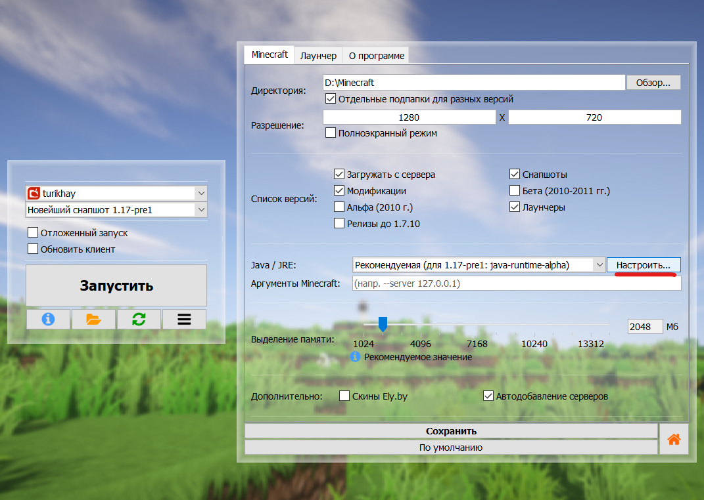

# Решение популярных проблем

В логах часто мелькают ошибки `EXCEPTION_ACCESS_VIOLATION` или Minecraft крашится с `exit code` из кучи цифр? Попробуйте эту инструкцию!

## Проверьте загруженность ПК
Откройте "диспетчер задач". Убедитесь, что у вас есть свободная оперативная память. Проверьте, что файл подкачки не отключен и не зафиксирован на конкретном значении.
:::tip[Не знаете, как настроить файл подкачки?]
Вот [инструкция для Windows](https://remontka.pro/fail-podkachki-windows/). Убедитесь, что у вас отмечена галочка "автоматически выбирать объем файла подкачки"
:::

## Установите другую версию Java
Мы подготовили для вас уже готовый пакет для замены Java. Воспользуйтесь [этой инструкцией](../faq/custom-java#%D1%83%D0%BF%D1%80%D0%BE%D1%89%D0%B5%D0%BD%D0%BD%D1%8B%D0%B9-%D1%81%D0%BF%D0%BE%D1%81%D0%BE%D0%B1).

## Отключите "Оптимизированные аргументы"
Лаунчер добавляет набор настроек Java, ориентированных на более плавную и стабильную работу игры, но в некоторых случаях эффект может быть противоположным.
1. Откройте настройки лаунчера, на вкладке "Minecraft" перейдите в настройки Java
    
2. В открывшемся окне снимите галочку "Добавлять оптимизированные аргументы"

## Удалите тяжелые графические моды
* Отключите шейдеры
* Выберите версию без OptiFine
* Удалите моды OptiFine, Sodium, Iris и им подобные из папки модов

## Удалите нестабильные моды
Следующие моды известны своей нестабильностью и склонностью к поломке игры:
* Моды от topka
* Моды от sacura
* Моды от darkness
* Моды от xorek
Удаление данных модов в большинстве случаев восстанавливает работоспособность игры.

## Драйвер видеокарты
Зачастую, проблемы с игрой начинаются из-за обновления или повреждения драйвера видеокарты.
* Попробуйте обновить драйвер видеокарты
* Если проблема началась после обновления драйвера, или проблема не уходит - попробуйте откатить драйвер видеокарты
    * Для этого вам нужно скачать и установить более старую версию драйвера
        * NVIDIA: [Архив версий драйверов](https://www.nvidia.com/Download/Find.aspx)
        * AMD: Найдите ваше устройство на [портале поддержки](https://www.amd.com/en/support) (не забудьте нажать "Submit"!) и кликните незаметную ссылку "Previous Drivers" в конце списка драйверов на открывшейся странице

## Проблемы с Windows
В некоторых случаях, игра не может запуститься из-за повреждений Windows.
1. Откройте меню "Пуск"
2. Наберите "Командная строка"
    
3. Выберите пункт "Запуск от имени администратора" и подтвердите запуск
    
4. В открывшемся окне наберите `sfc /scannow` и нажмите Enter
    
5. Дождитесь сообщения о завершении проверки и **отсутствии проблем** либо восстановлении **всех** поврежденных файлов
    :::danger[Модифицированные версии Windows]
    Если вы используете модифицированную версию Windows, то в ней могут быть повреждены или отсутствовать компоненты, требуемые как для запуска игры, так и для восстановления Windows. Переустановите Windows, используя оригинальный установочный образ
    :::

## Отключение программ, встраивающихся в другие программы
На стабильность работы игры могут повлиять программы, вторгающиеся в другие программы с целью их оптимизации, разгона, мониторинга или читерства.
* Отключите все трейнеры, инжекторы, читы
* Отключите оверлеи Discord, GeForce Experience (NVIDIA)
* Отключите или удалите RivaTuner Statistics Server, MSI Afterburner и подобные
* Некоторые VPN и прокси ведут себя как нежелательное ПО, например, SafeIP. Удалите подобные программы.
* Проверьте ПК на вирусы, удалите вредоносное ПО
* Попробуйте временно отключить антивирус

## Ничего не помогает?
Боюсь, на этом способы решить данную проблему заканчиваются. Но вы можете попробовать установить другую операционную систему - Linux - и поиграть в Minecraft на ней.