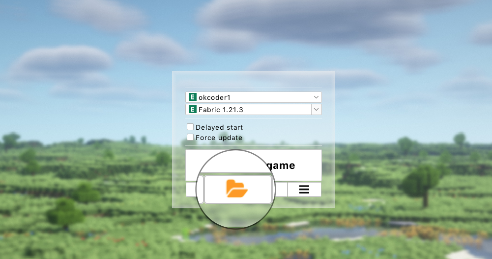
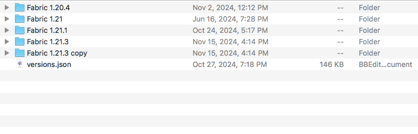
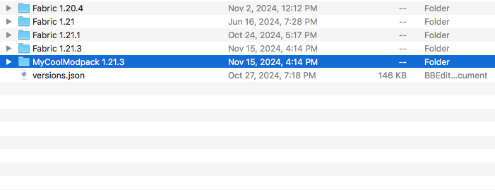
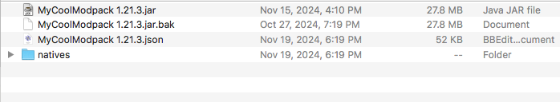

# Version cloning
This guide will be useful for modpack creators and players who want to keep multiple modpacks for same version using "[Subfolders](../launcher/subfolders)" feature.
:::info
This page requires localization of _one_ screenshot. Feel free to [open a PR](https://github.com/LegacyLauncher/docs) if you want to help!
:::

## How to clone a version? {#how-to}
:::note
This guide assumes you're using "[Subfolders](../launcher/subfolders)" feature
:::
1. Start Legacy Launcher
2. Click "Open game folder" (the one with folder icon) button to open game folder
    
    * Launcher may ask you to select a folder. You should select "root folder"
        
3. Open `versions` folder
    
4. Find a version you want to clone and copy it
    
5. Choose a new version name. We will use `MyCoolModpack 1.21.3` for this guide
6. Rename created folder copy to selected name
    
7. Open renamed folder. Rename both jar and json files to the same name as folder.
    
    :::warning
    Folder name **must be the same** as contained files names, otherwise the launcher **will not be able** to detect this version.  
    For example: if folder name is `MyCoolModpack 1.21.3` it must contain `MyCoolModpack 1.21.3.json` and `MyCoolModpack 1.21.3.jar` files, all other files will be ignored.
    :::
8. Open renamed json file with any text editor (e.g. [Notepad++](https://notepad-plus-plus.org/downloads/))
    :::note
    You **should not** use any office suite!
    :::
9. Find `id` field and replace it with selected version name
    ```json
    {
        // highlight-next-line
        "id": "MyCoolModpack 1.19.2",
        "jar": "1.19.2",
        "family": "Forge-1.19",
        "time": "2023-09-16T19:39:53.686Z",
        "releaseTime": "2022-08-05T11:57:05Z",
        "type": "modified",
        "mainClass": "cpw.mods.bootstraplauncher.BootstrapLauncher",
        "minimumLauncherVersion": 21,
        …
    ```
    * If you're using "Subfolders" feature in "Separate folder for each family" mode you must also rename the `family` field. *The family name is not required to be the same as the version name, and you can use one family name for multiple versions*
        ```json
        {
            "id": "MyCoolModpack 1.19.2",
            "jar": "1.19.2",
            // highlight-next-line
            "family": "mycoolmodpack",
            "time": "2023-09-16T19:39:53.686Z",
            "releaseTime": "2022-08-05T11:57:05Z",
            "type": "modified",
            "mainClass": "cpw.mods.bootstraplauncher.BootstrapLauncher",
            "minimumLauncherVersion": 21,
            …
        ```
10. Save the file
11. Restart the launcher. Cloned version should appear with the selected name
