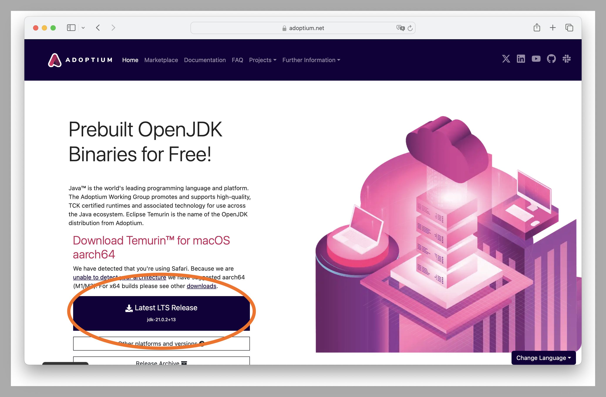

# Java installation
:::info
This page requires localization of screenshots. Feel free to [open a PR](https://github.com/LegacyLauncher/docs) if you want to help!
:::

Legacy Launcher [jar](https://llaun.ch/jar), [beta](https://llaun.ch/latest) and most modloader installers require installed Java.
:::tip[Check if java is installed]
You can check if Java is installed and find its version by opening Terminal (or Command Line, or PowerShell) and executing the `java -version` command in it
:::
:::info
You're not required to install any Java to launch Minecraft. Legacy Launcher will automatically download any required Java version from Mojang repositories
:::

## Windows
1. Install Java installer from [Temurin](https://adoptium.net/temurin/releases/?package=jre) or [Oracle](https://www.java.com/download/) website
2. Launch downloaded file with double-clicking it
3. Follow instructions in the installation wizard
4. Done!
    :::tip[You're trying to open jar file, but an archive opens up?]
    Right click on the jar file, select "open with" => "OpenJDK" or "Java"
    
    :::
    :::warning
    If you've installed Java, but double-clicking a jar file does nothing, you should try [JarFix](https://johann.loefflmann.net/downloads/jarfix.exe) to create file associations
    :::

## Linux
Please consult your distribution's documentation  
The following are commands for installing Java on the most popular distributions:
* Ubuntu, Mint, Debian: `apt install openjdk-17-jre`
* CentOS, Fedora: `yum install java-17-openjdk`
* Arch Linux, Manjaro: `pacman -S jre17-openjdk`
:::note
You may require root permissions to install Java
:::

You may need to create the following file to be able to run jar files by double-clicking:
```ini title="/usr/share/applications/jre-openjdk.desktop"
[Desktop Entry]
Name=OpenJDK Default Java Runtime
Comment=OpenJDK Default Java Runtime
Keywords=java;runtime
Exec=java -jar
Terminal=false
X-MultipleArgs=false
Type=Application
Icon=java
MimeType=application/x-java-archive;application/java-archive;application/x-jar;
NoDisplay=true
```

## macOS
We recommend using the JRE/JDK from Adoptium.
If your device runs on Intel platform, choose the version for `x64` architecture.
If your device runs on an ARM processor (M1, M2, M3 and so on), choose the version for `aarch64`.

1. Open the [Adoptium](https://adoptium.net) website, and download the recommended version if your platform is detected correctly. 
2- Open the downloaded file and follow the on-screen instructions. 
3. Done! The latest version of the JDK (Java) is installed on your Mac.
4. To install Legacy Launcher manually, [follow the instructions in this article](./mac-manual).
