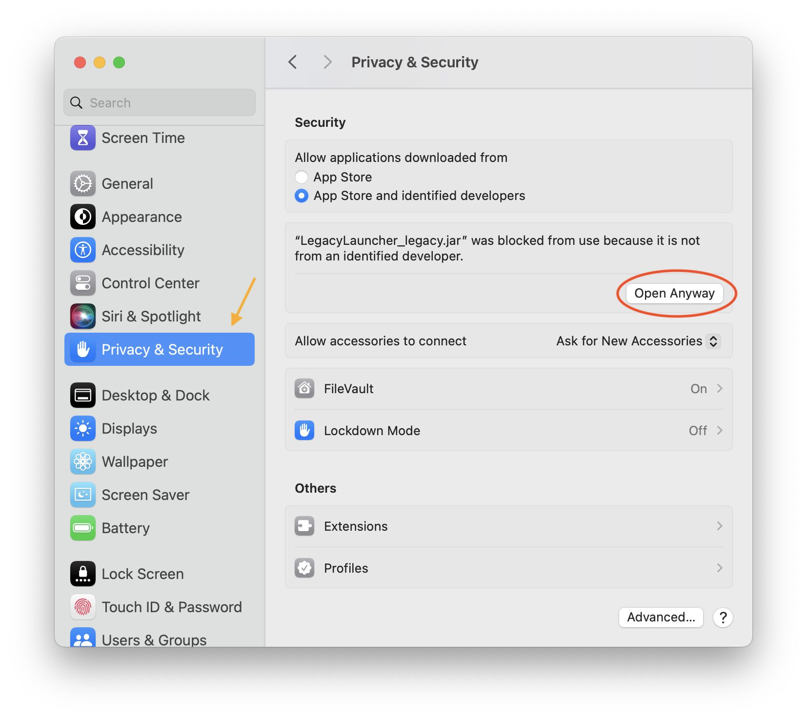
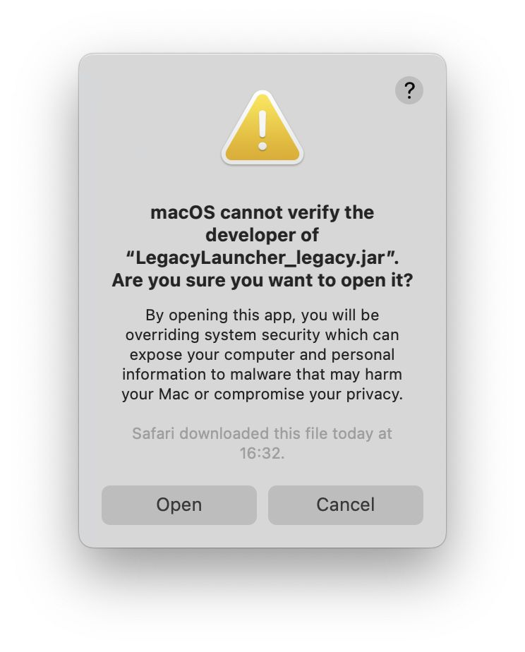

# Manual installation for macOS users

:::warning
You must have a recent version of Java installed on your Mac device before you start.
We wrote more about this [in a related article](./java#macos).
:::

In this article, we'll cover installing Legacy Launcher manually on macOS version 14.3.1. On older versions of macOS, the steps will be about the same. This method is suitable for those who failed to install the Launcher [using the traditional installation method](https://llaun.ch/macos).

1. Download the launcher JAR file: https://llaun.ch/jar 
2. Try to open the downloaded file 
3. The system should warn you that the file cannot be opened due to security policy. Click "OK" 
4. Open "System Preferences" and find "Privacy & Security" in the left side menu. Scroll down the main part of the window and find the "Security" block. You'll see a "Open anyway" button under the mention of the Launcher. Click on this button to unlock the Legacy Launcher launcher.  
5. If you did everything correctly, the launcher will open. Done! 