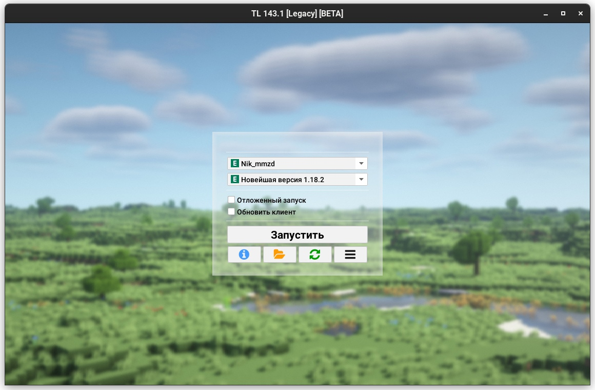
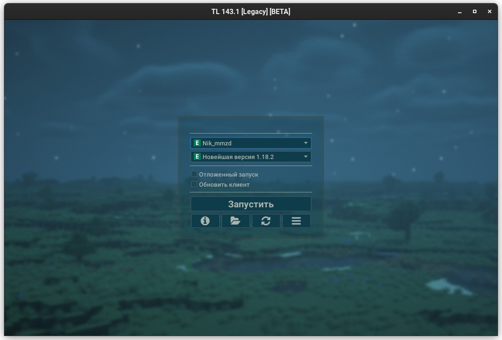
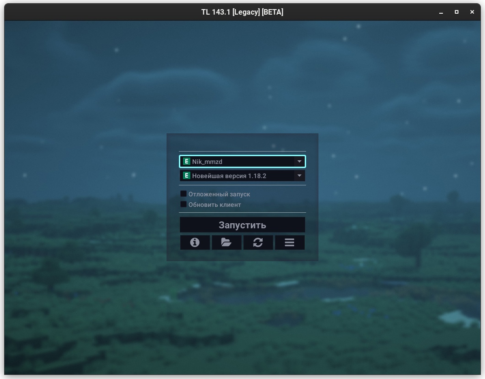

# Customization and Themes
:::info
This page requires localization of screenshots. Feel free to [open PR](https://github.com/LegacyLauncher/docs) if you want to help
:::

import Tabs from '@theme/Tabs';
import TabItem from '@theme/TabItem';

## Via Launcher Settings {#settings}
In the launcher settings you can customize the following elements of the launcher:
* Display notices and ads (check "show notices under login form")
* Launcher language
* Launcher theme (dark, light, automatic)
* Main (login) form position
* Font size
    :::warning
    This feature is not recommended for use and will be removed in version 161.0. Consider using [HiDPI](./hidpi)
    :::
* Launcher window size
* Launcher window background (`jpg`, `png` and `mp4` are supported)
    :::note[Video-background]
    Legacy Launcher supports video-backgrounds in `mp4` format. This functionality requires a Java with JavaFX support. Animated images in `gif` and `animated png` formats are not supported
    :::

## Via FlatLaF Themes {#flatlaf}
:::info
FlatLaF themes are supported in Legacy Launcher starting with version 143.0
:::
### Embedded Themes {#flatlaf-embedded}
In addition to the standard `light` and `dark` themes, `intellij` (light) and `darcula` (dark) themes are available.  
A special `system` theme is also available to use the Java system theme.

### External FlatLaF Themes {#flatlaf-external}
You can create your own FlatLaF theme or use an existing one!  
Just download the theme json file and specify the path to it in the launcher configuration file
:::tip
You can view the available themes and download json files in [FlatLaF Demo App](https://www.formdev.com/flatlaf/#demo).
:::
:::info
Want to create a topic on your own? FlatLaF documentation is available for you:
    * [Themes](https://www.formdev.com/flatlaf/themes/)
    * [Customizing](https://www.formdev.com/flatlaf/customizing/)
    * [Theme Properties](https://www.formdev.com/flatlaf/properties-files/)
:::

### External Theme Setup {#flatlaf-setup}
1. Close the Legacy Launcher
2. Open Legacy Launcher configuration file using any text editor (e.g. [Notepad++](https://notepad-plus-plus.org/downloads/))
    :::tip
    Launcher configuration file will most often be located either in the `.tlauncher/legacy.properties` folder, or in the `tl.properties` file in the installer path of the game (`.tlauncher/legacy/Minecraft/tl.properties`)
    :::
3. Find or create following lines:
    * `gui.laf.v1.flatlaf.light` - to replace light theme
    * `gui.laf.v1.flatlaf.light.ui-properties-file` - to apply theme `properties` file to the light theme
    * `gui.laf.v1.flatlaf.dark` - to replace dark theme
    * `gui.laf.v1.flatlaf.dark.ui-properties-file` - to apply theme `properties` file to the dark theme
4. Specify the desired theme file or settings file path. You can specify the *embedded* theme name using the `:` symbol, e.g. `gui.laf.v1.flatlaf.light=:system`
5. Save the file and restart the launcher

### Theme Setup Examples {#flatlaf-examples}
```mdx-code-block
<Tabs>
<TabItem value="Darcula">
```


```mdx-code-block
</TabItem>
<TabItem value="IntelliJ">
```

```mdx-code-block
</TabItem>
<TabItem value="Solarized Light">
```

```mdx-code-block
</TabItem>
<TabItem value="Solarized Light High-Contrast">
```

```mdx-code-block
</TabItem>
<TabItem value="Solarized Dark">
```

```mdx-code-block
</TabItem>
<TabItem value="Material Deep Ocean">
```

```mdx-code-block
</TabItem>
</Tabs>
```

## Via Legacy Themes {#legacy}
:::warning
This themes format is designed especially for Legacy Launcher, but allows only partial modification of the interface look and feel. We recommend to use **FlatLaF** themes
:::
The color scheme is stored in a `.properties` file with UTF-8 encoding.

You can pass the theme file location either by specifying the path in the settings file in the `gui.theme` field, or by passing the `--theme path` argument

### Used Types {#legacy-types}
* `color` - sets a color in `Red.Green.Blue[.Alpha]` format, e.g. `255.255.255.128` sets a translucent white color and `0.0.0.0` - opaque black
* `int` - sets the size in positive integer format (i.e. greater than or equal to 0)
* `enum` - indicates that the field can only accept the specified values (or none)
* `mixed` - field can take several types of values from those described above

### Theme File Syntax {#legacy-syntax}
| Ключ                  | Тип                                  | Описание                                                                                                                  |
|-----------------------|--------------------------------------|---------------------------------------------------------------------------------------------------------------------------|
| `foreground`          | `color`                              | Foreground color (text) color                                                                                             |
| `background`          | `color`                              | Background color (background in text fields)                                                                           |
| `semiforeground`      | `color`                              | Color of the placeholder text (tooltips in text fields)                                                                  |
| `panelbackground`     | `color`                              | Panels color (login form, settings, etc.)                                                                               |
| `success`             | `color`                              | Permissive color (dark green by default)                                                                             |
| `failure`             | `color`                              | Prohibition color (dark red by default)                                                                             |
| `border`              | `color`                              | Default panel border color                                                                                          |
| `border.size`         | `int`                                | Size of the outer borders панелей                                                                                             |
| `shadow`              | `mixed`: (`color`, `enum`: `border`) | Specifies the color of the inner shadow. If `border` is set, the initial color of the inner shadow defaults to the panel border color |
| `icon.defaultColor`   | `color`                              | Default icon color                                                                                                  |
| `icon.color.<icon-name>` | `color`                              | Icon `icon-name` (e.g. `icon.color.refresh`)                                                                         |
| `border.<panel>`     | `color`                              | Border color of the specified panel type                                                                                      |
| `shadow.<panel>`     | `color`                              | Initial shadow color of the specified panel type                                                                               |
| `arc.<panel>`        | `int`                                | Boundary curvature radius of the specified panel type |                                   

Available panel types:
* `main_panel` - represents the main panels (login form, authorization forms)
* `additional_panel` - represents additional panels ("Preferences", login form prompts)
* `settings_panel` - presents the inner panel in the settings panel

### Examples {#legacy-examples}
```properties title="example-theme.properties"
foreground=0.0.0
background=255.255.255
panelbackground=255.255.255.64
shadow=0.0.0.0
arc=16
```
```properties title="nostalgic.properties"
# This theme replicates the old Legacy Launcher panel design
border=28.128.28.255
border.size=2
arc=32
shadow=0.0.0.0
panelbackground=255.255.255.168
border.main_panel=28.128.28.255
border.additional_panel=28.128.28.255
border.settings_panel=28.128.28.255
```