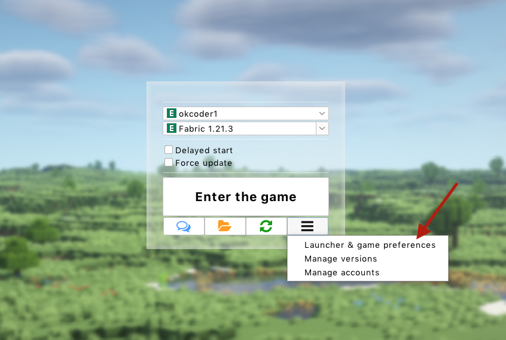
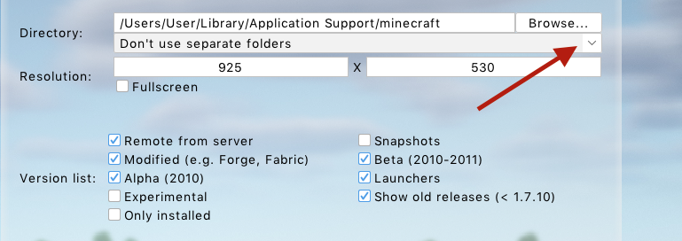

# Subfolders
Since mods for different versions of the game and modloaders are not compatible with each other, we've added a "Subfolders" feature
:::tip
You can use this feature as a replacement for profiles to keep several different builds on the same version of the game at the same time. See the related [manual](../faq/custom-versions) for more details
:::

## Enabling Subfolders {#enable}
1. Start the Legacy Launcher
2. Click the "Advanced" button
    
3. Select the "Launcher & game preferences" item.
    
4. Select the "Minecraft" tab
    
5. Under "Directory", select the required mode
    

## "Subfolders" feaure modes {#modes}
Legacy Launcher supports three modes of operation for this option.
:::info[How to find the game folder?]
Regardless of your settings, you can always open the game or mods folder of the selected version by clicking the folder icon in the launcher main menu
:::
:::warning
You must specify the same folder in the mod/version installers (e.g. Fabric and Forge installers) as in the "Directory" item **regardless of the selected "Subfolders" mode**, as this is the folder where all game files are stored.
:::

### Don't use separate folders {#mode-none}
The game will be launched in the game folder. No subfolder separation will be performed.

### Use separate folder for each family {#mode-families}
For each version of the game a folder of its "family" will be created in the `home` folder in the game folder. This folder will store all the settings, worlds, mods, resourcepacks, shaderpacks of the version.  
**Families** is a set of versions with a similar modloaders and similar versions. For example, `1.8.9` and `1.8.8` would belong to the `1.8` family, and `Fabric 1.19.2` and `Quilt 1.19.2` would belong to `Fabric-1.19`. There is a separate family for all snapshots - `snapshots`.  
As an example, version `1.8.9` will run in `game-directory/home/1.8`, and `Forge 1.12.2` will run in `game-directory/home/Forge-1.12`.

### Use separate folder for each version {#mode-versions}
For each version of the game, a folder with **version name** will be created in the `home` folder in the game folder. In this folder will be stored all settings, worlds, mods, resourcepacks, shaderpacks of the version. Families are not taken into account in this mode.  
As an example, version `1.8.9` will be run in `game-directory/home/1.8.9`, and `Forge 1.12.2` - in `game-directory/home/Forge 1.12.2`.
