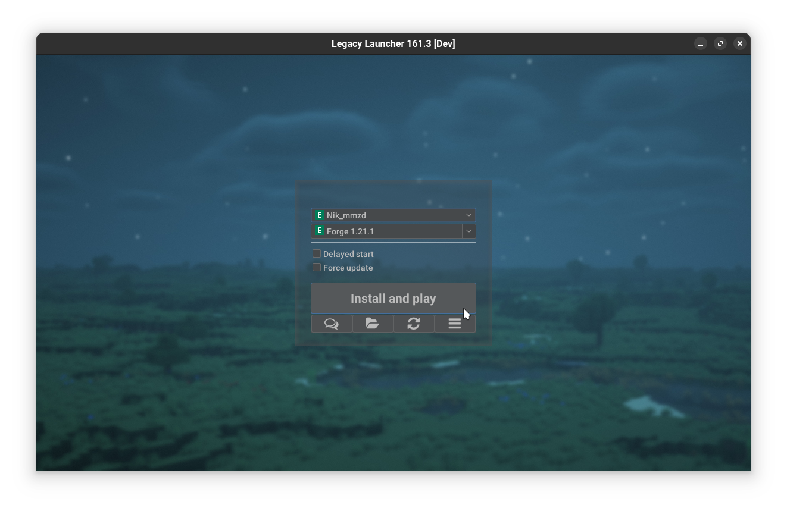
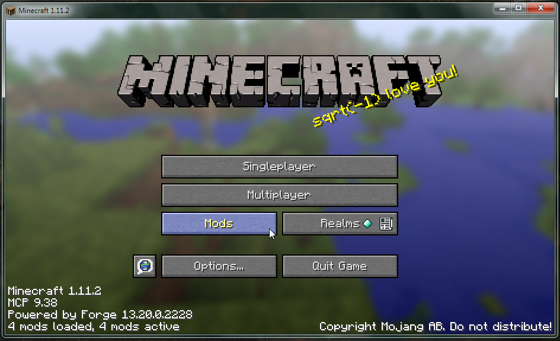
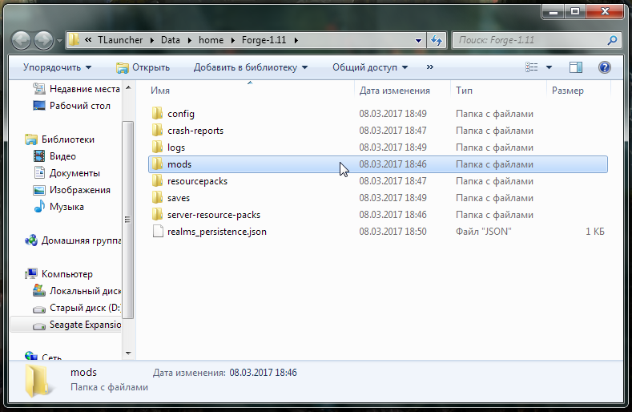
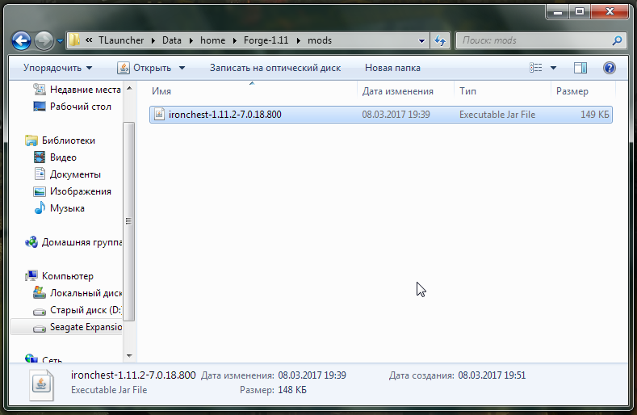
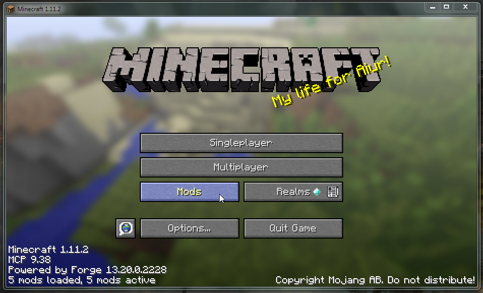
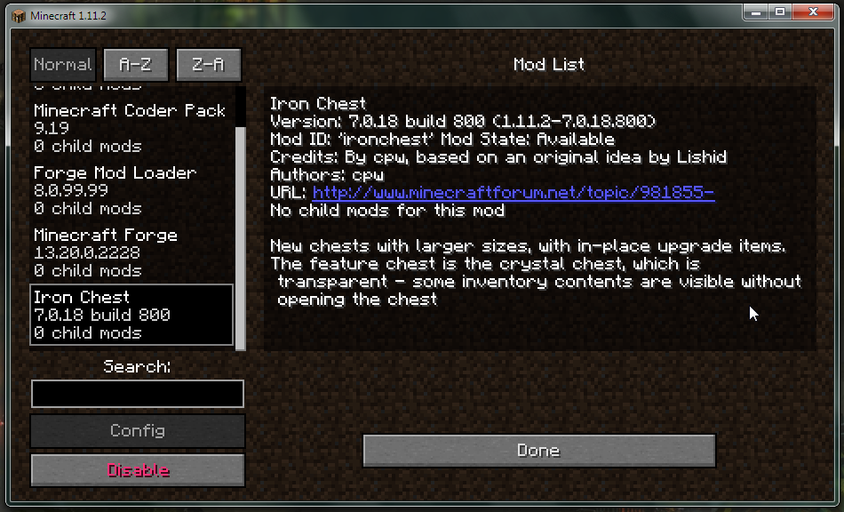
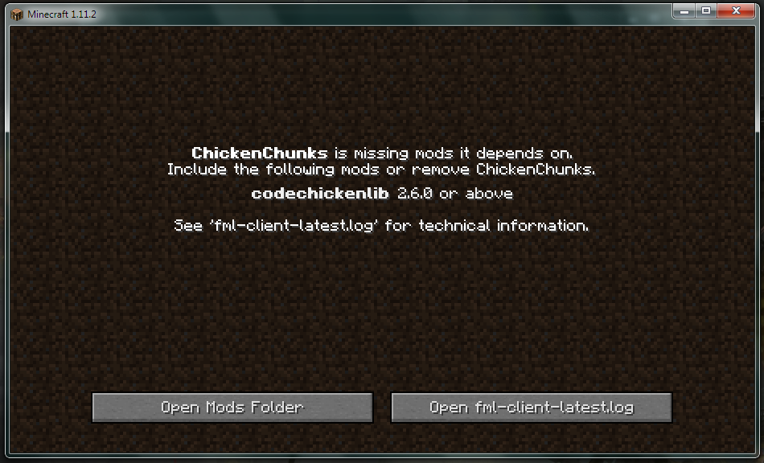

# Mods Installation
Modifications (aka mods) are custom add-ons that extend the basic features of the game by adding new blocks, tools, weapons, mobs, dimensions and more.  
This guide describes how you can install mods.
:::warning
The screenshots in this guide are slightly outdated and are missing localization.  
If you have a chance, please help us [update](https://github.com/LegacyLauncher/docs/pulls) this guide!
:::
:::tip[Modpacks installation]
Looking for instructions on how to install modpacks? Check out [this manual](./modpacks)
:::
:::tip[OptiFine installation]
Looking for instructions on how to install OptiFine? Check out [this manual](./optifine)
:::

## Preparations for installation {#preparation}
:::tip[Portable client]
If you plan to distribute your modpack to other people - it might be worth looking into creating a [portable client](../launcher/portable)
:::
:::info[Subfolders]
To keep mods, worlds and settings for different versions of the game and mod loaders from mixing with each other and causing issues, we recommend using [Subfolders](../launcher/subfolders) feature.
:::

1. Start Legacy Launcher
2. Install the required version of the modloader. Different mods may require different modloaders. At the time of writing, Legacy Launcher provides a choice of three modloaders: Forge, Fabric and Quilt.
    :::tip[Missing modloader?]
    You can install any version of [Forge](./forge), [NeoForge](./neoforge), [Fabric](./fabric) or [Quilt](./quilt) yourself.
    :::
    :::warning
    Mods for NeoForge *may not* be compatible with Forge.  
    Mods for Quilt *may not* be compatible with Fabric.  
    Mods for Fabric/Quilt and Forge/NeoForge **are not** compatible with each other.
    :::
    
3. Make sure the version is able to launch.
    
    :::warning[Got a crash?]
    Make sure you don't have mods for other game versions or modloaders installed.  
    Still not launching? You can try our [self-repair guide](../troubleshooting/self-repair) or [contact technical support](../support/game)
    :::

## Mods installation {#installation}
1. Find and download desired mods
    :::tip[Mod download sources]
    We recommend you to use official mods sources: [Modrinth](https://modrinth.com/mods) and [CurseForge](https://www.curseforge.com/minecraft/search?class=mc-mods)
    :::
2. Start Legacy Launcher and open game folder
    
3. Go to mods folder
    
4. Place downloaded mods in the mods folder
    
5. Launch the game to make sure game is able to run
    
    :::note
    You can see that the number of mods that Forge ModLoader has loaded has increased (there were 4 mods, now there are 5). You can also see the modification in the list, which can be accessed by clicking on the "Mods" button in the main menu of the game.
    
    :::
6. Done! You can now start using mods

## Common issues {#troubleshooting}
Despite the relative ease of installing mods, users sometimes make mistakes that cause the game client to crash.

### Archive-in-archive {#archive}
Most unofficial mods sources mods are packed into an archive to cut some storage costs. Minecraft will ignore such archives. The solution is simple: extract mod jar file from the archive.

### Extracted mod file {#extracted}
This mistake is often caused by previous one: one extracted mod jar by mistake. Solution: pack extracted files to zip archive and rename `.zip` to `.jar`... Or re-download mod.

### Missing dependencies {#dependencies}
For a long time mod developers have been using other mods to create own. This results in a mods not working without the mod it was created with (i.e. without *dependency*).  
One who does not know this may simply forget to install the dependencies necessary for the mod to work. The result can be a broken game client or a warning message in the game after loading.

It's easy enough to solve this problem: just download the missing mod version stated in the message (in the example it's `CodeChickenLib 2.6.0`).

### Wrong game version {#wrong-game-version}
This error is caused by the fact that the one downloaded a mod not for selected game version. For example, he needed a mod for Minecraft 1.8, but he downloaded a mod for Minecraft 1.6.4. To solve this problem is quite simple: you need to find the same mod, but only for your version of the game.
The other cause is switching version. One has mods for 1.7.10, but switched to 1.12.2 and forgot to remove old mods. Consider using [Subfolders](../launcher/subfolders) feature.
:::note
Sometimes mod authors end support for mods or do not release their mod for older versions of the game. Because of this, for example, a mod that was on Minecraft 1.7.10, will never appear for Minecraft 1.12.2. In this case, you can only look for an alternative or learn to develop your own mods.
:::

### Wrond modloader version {#wrong-modloader-version}
Legacy Launcher provides **stable** modloader versions only. If a mod requires a different modloader version, you must install the required version of [Forge](./forge), [NeoForge](./neoforge), [Fabric](./fabric) or [Quilt](./quilt) yourself.

### Mod-specific troubleshooting {#specific}
Some mods require special client configuration. For the most popular cases we have created [separate set of instructions](/mod-specific)

### Nothing works! {#nothing-works}
You can try our [self-repair guide](../troubleshooting/self-repair) or [contact technical support](../support/game).