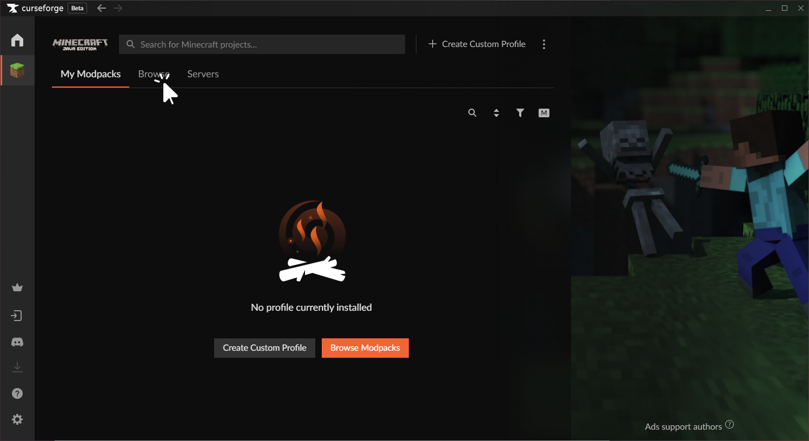
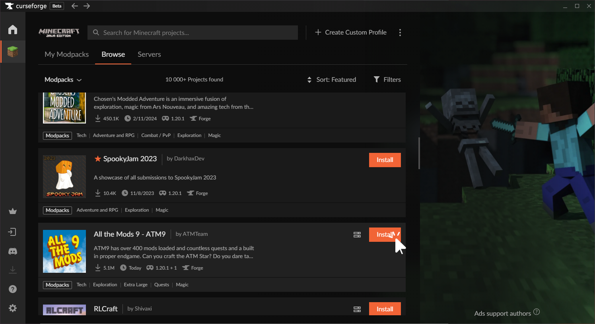
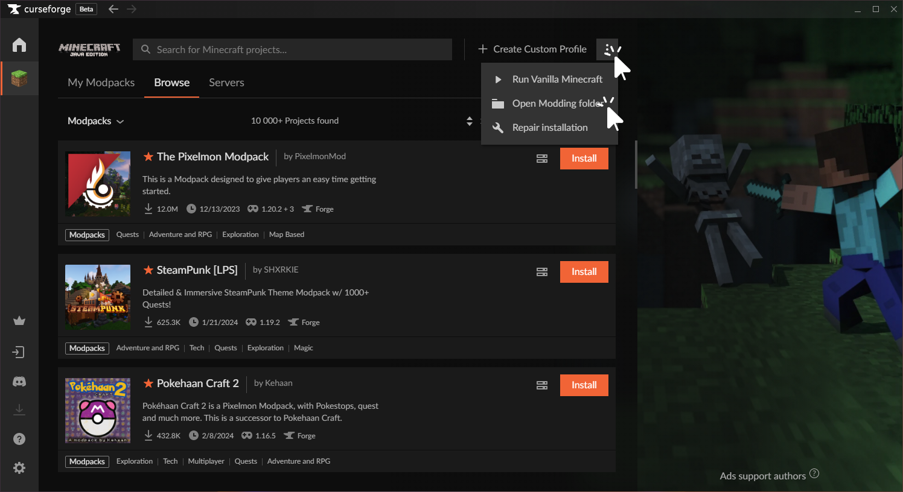
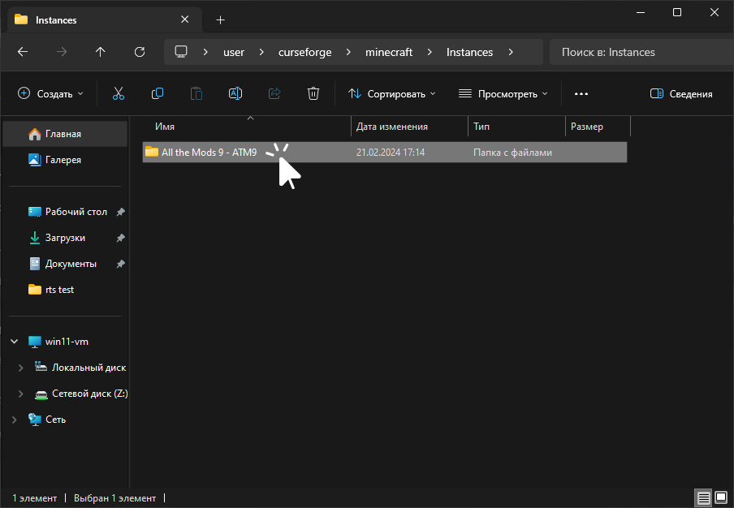
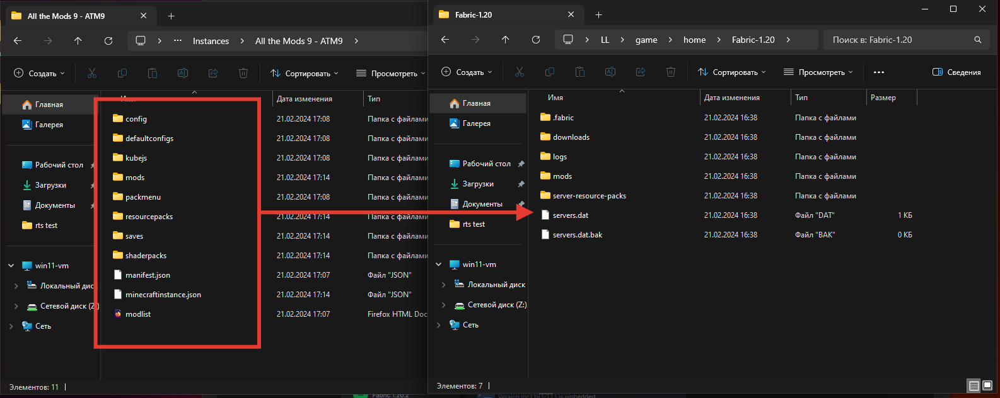

# Modpacks Installation
:::info
This page requires localization of screenshots. Feel free to [open PR](https://github.com/LegacyLauncher/docs) if you want to help
:::
Installation modpack in general does not differ from [mods installation](./installation). It all depends on the source of the modpack.

## Curseforge
1. Download and install [CurseForge app](https://www.curseforge.com/download/app)
    :::tip
    We recommend you to use "Standalone" app, not "Overwolf" one
    :::
2. Select "Minecraft" game
    
3. Open "Browse" tab
    
    :::tip
    CurseForge app allows one to create own modpacks. One can do it using "Create Custom Profile" option. This manual does not cover this use case
    :::
4. Select a modpack and press "Install" button
    
5. Wait until all game files are downloaded
6. Open modpacks folder
    
7. Go to `Instances`
    
8. Find modpack folder and open it
    
9. Install required [modloader](/tags/modloader)
10. Start Legacy Launcher and open game folder
    
11. Move modpack files to game folder
    
12. Done! You're ready to launch the game

## Modrinth
1. Select a modpack on [Modrinth](https://modrinth.com/modpacks)
2. Download modpack `.mrpack` file
    
3. Open [Modrinth Pack to Zip](https://download.fo/mrpack-to-zip/) website
4. Under the "Use existing mrpack" click "Choose a file..."
    
5. Select previously downloaded `.mrpack` file
    
6. Press "Download" button and wait until all modpack files are downloaded
    
7. You'll be promted to save modpack zip file
8. Install required [modloader](/tags/modloader)
9. Start Legacy Launcher and open game folder
    
10. Move modpack files to game folder
    
11. Done! You're ready to launch the game

## Other websites {#other}
Most other websites (and other users) will use an zip, 7z or rar archive for modpacks.
1. Install required [modloader](/tags/modloader)
2. Start Legacy Launcher and open game folder
    
3. Open modpack archive
4. Move modpack files to game folder
    
5. Done! You're ready to launch the game