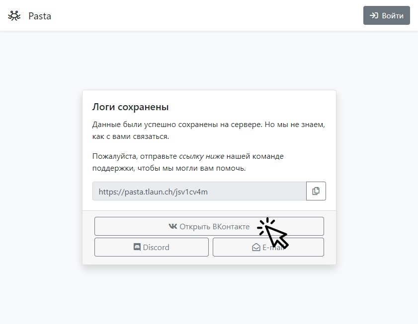
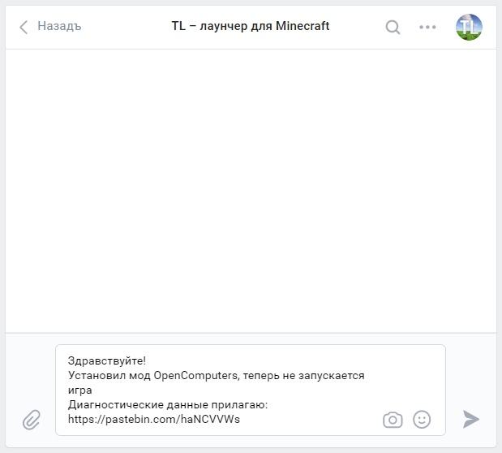

# Need help?
This page contains instructions on how to describe problems with Legacy Launcher.
:::tip
Don't want to wait? Try our [self-repair](../troubleshooting/self-repair) manual
:::
:::info
This page requires localization of screenshots. Feel free to [open a PR](https://github.com/LegacyLauncher/docs) if you want to help!
:::

## Collect Diagnostic Data {#collect}
1. Make sure you're using the latest launcher version. Try to enable launcher beta in settings
2. Check that your computer/laptop meets [Minecraft system requirements](../system-requirements)
3. Try to re-run the game. Make the error occur again.
4. Click "Need help?" in error window
    
    :::note[No error window? No "Need help?" button?]
    1. Click "Information" button
        
    2. Select "Need help?" in drop-down menu
        
    :::
5. Send diagnostic data
    :::warning
    Don't forget to check the "send diagnostic data" box!
    :::
    
    :::note
    If launcher fail to send diagnostic data, you will asked to save them as a file. Save them at your convenience and upload them to us [manually](https://pasta.llaun.ch)
    :::
6. Open the given link
    
7. In your browser, **be sure to copy the link provided** - we'll need it to solve the problem
    

## Contact our support {#contact}
Choose a preferred contact method - [Discord](#discord) or [VK](#vk)

### Discord {#discord}
:::note
Support in Discord is provided mainly by volunteers
:::

1. Join [our Discord](https://llaun.ch/discord/intl)
    
2. Open the "need-help" channel
    
3. Press "New post" button in top-right corner
    
4. Enter a short title and describe the problem. Select the appropriate tags. Don't forget to paste the link you copied earlier or the file you received earlier.
5. Post a message and wait for a response.
    

### VK {#vk}
:::note
Support in VK is only provided by the developers. The waiting time for a response may reach several days.
:::

1. Open new chat with our [VK group](https://llaun.ch/vk)
    
2. Describe the problem, copy the link you copied earlier and/or the file you received earlier into the chat
    
3. Send a message and wait for a reply. We will reply at the first opportunity.

### E-Mail {#email}
We do not provide technical support via e-mail at this time. Please use the methods above.
