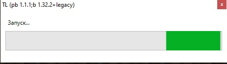

# Legacy exe issues
:::info
This page requires localization of screenshots. Feel free to [open PR](https://github.com/LegacyLauncher/docs) if you want to help
:::
```mdx-code-block
<div style={{textAlign: 'center'}}>
```
  
```mdx-code-block
</div>
```
"Cannot find bootstrap"? "No available JRE"? "Please check Internet connection"? There is a window with "Launching" and it does not close?  
That's because you're using **outdated exe**.

## Solution {#solution}
Install up-to-date version from [the our website](https://llaun.ch) or [the mirror](https://lln4.ru)

## Will I loose all my worlds, mods, accounts? {#user-data}
No. But you can create a backup copy just to be sure.

## I installed the update, and all my data is lost! {#data-missing}
Your data is not lost. You should select previously used game folder in launcher settings or move all files to new game folder.

## I'm using a Portable Client, what should I do? {#portable}
Download up-to-date portable client from the [out website](https://llaun.ch/portable) or [the mirror](https://lln4.ru/portable) and move all your data to new client.
:::tip
You may find [our portable client manual](../launcher/portable) useful
:::

## I'm using a MineModPacks modpack, what should I do? {#minemodpacks}
1. Remove old exe from client folder and `.pbargs` file
2. Download up-to-date portable client from the [out website](https://llaun.ch/portable) or [the mirror](https://lln4.ru/portable)
3. Move all files from new portable client to modpack folder, confirm overwriting if necessary
4. Open `tl.args` file with any text editor (e.g. [Notepad++](https://notepad-plus-plus.org/downloads/)) and replace its content with following:
    ```bash title="tl.args"
    --packageMode
    portable
    --targetJar
    launcher/launcher.jar
    --targetLibFolder
    launcher/libraries
    --
    --settings
    Launcher/Launcher.properties
    --background
    Launcher/Background.png
    --directory
    ./Minecraft
    --version
    MineModPacks
    ```
5. All is done! Your modpack should be able to launch now.
    :::warning
    If this guide does not help you may try to move all game files (mods, configs, scripts, versions) to new portable client or ask [MineModPacks owner](https://minemodpacks.ru/%D0%B8%D0%BD%D1%84%D0%BE%D1%80%D0%BC%D0%B0%D1%86%D0%B8%D1%8F#%D0%9A%D0%BE%D0%BD%D1%82%D0%B0%D0%BA%D1%82%D1%8B) for help
    :::