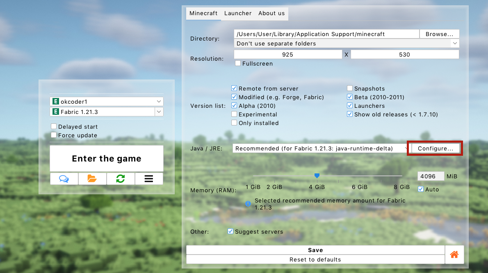

# Java crashes (Windows)
:::info
This page requires localization of screenshots. Feel free to [open a PR](https://github.com/LegacyLauncher/docs) if you want to help!
:::
:::note
This guide is for unclear crashes related to Java, specifically on Windows. We recommend first checking for [common issues](./common).
:::
Do you often see `EXCEPTION_ACCESS_VIOLATION` errors in the logs or Minecraft crashes with weird `exit code`? Try this manual!
:::warning
If you've been directed here, it means the cause of the error is **unknown to us**, and the issue occurred **on Java's side or in a system library**.  
This guide contains various _potential_ solutions based on user reports.  
If you encounter an issue and resolve it using this guide, please let us know which step helped you.  
If you find your own solution after being directed here, please share it with us as well. You might help other players!
:::

## Check PC Load {#check-load}
Open "Task Manager". Ensure you have free RAM available. Check that the page file (also known as swap file) is not disabled nor set to a fixed size.
:::tip[Not sure how to configure the page file?]
Here's a [Windows guide](https://www.tomshardware.com/news/how-to-manage-virtual-memory-pagefile-windows-10,36929.html). Ensure the "Automatically manage paging file size for all drives" checkbox is selected.
:::

## Try another Java distribution {#replace-java}
We've prepared a ready-to-use package for replacing Java. Follow [this guide](../faq/custom-java#how-to-simplified).

## Disable "Optimized arguments" {#disable-arguments}
The launcher adds a set of Java settings designed for smoother and more stable gameplay, but in some cases, the effect can be the opposite.
1. Open the launcher settings, go to the "Minecraft" tab, and navigate to Java settings.
    
2. In the opened window, uncheck the "Add optimized arguments" box.
    
    :::note
    In newer launcher versions, you can try a different set of optimized arguments instead of completely disabling them.
    :::

## Remove "visuals" and familiar mods {#remove-bad-mods}
Remove ["visuals" and familiar mods](/mods/specific/visuals)

## Remove Graphics Mods {#remove-graphics-mods}
Certain graphics card drivers have been observed to work poorly with optimization mods. An alternative might be a [driver rollback](#gpu-driver). The following mods may cause crashes due to driver bugs:
* OptiFine
* Sodium and its ports (Magnesium, Rubidium, Embeddium...)
* Iris and its ports (Oculus)

## Graphics Card Driver Issues {#gpu-driver}
Game issues often arise due to graphics driver updates or corruption. If this doesn't help, try [removing graphics mods](#remove-graphics-mods).
* Try updating your graphics card driver.
* If the problem started after a driver update or persists, try rolling back the driver.
    * To do this, download and install an older driver version:
        * NVIDIA: [Driver version archive](https://www.nvidia.com/Download/Find.aspx)
        * AMD: Locate your device on the [support portal](https://www.amd.com/en/support) (don't forget to click "Submit"!) and click the subtle "Previous Drivers" link at the bottom of the driver list on the page.

## Windows Corruption {#windows}
In some cases, the game cannot run due to Windows corruption.
1. Open the Start menu.
2. Type "Command Prompt."
    
3. Select "Run as Administrator" and confirm.
    
4. In the opened window, type `sfc /scannow` and press Enter.
    
5. Wait for a message confirming the scan's completion and **absence of issues** or the restoration of **all** corrupted files.
    :::danger[Modified Windows Versions]
    If you use a modified version of Windows, required components for both game operation and Windows restoration might be damaged or missing. Reinstall Windows using an original installation image.
    :::

## Disable Programs Interfering with Others {#injectors}
Game stability can be affected by programs that interfere with others for optimization, overclocking, monitoring, or cheating purposes.
* Disable all trainers, injectors, and cheats.
* Disable Discord overlays, GeForce Experience (NVIDIA), and similar tools.
* Disable or uninstall RivaTuner Statistics Server, MSI Afterburner, and similar programs.
* There have been reports of crashes caused by game recording with OBS. This is usually a [driver bug](#gpu-driver).
* Some VPNs and proxies act like malware, such as SafeIP. Remove such programs.
* Check your PC for viruses and remove malware.
* Temporarily disable your antivirus software.

## Nothing Helps? {#nothing-helps}
Unfortunately, your issue is not related to the launcher, and we can't help you with it. Everything we could suggest is already listed on this page.  
Try to find a solution yourself - if you succeed, please share it with us!
